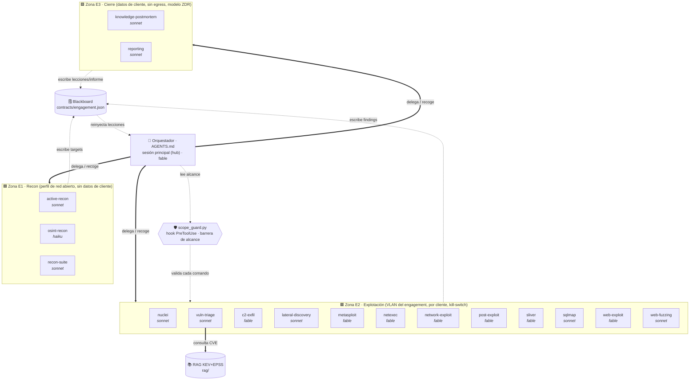

<!-- ⚠️ FICHERO AUTO-GENERADO por tools/gen_arch_diagram.py — NO editar a mano. -->
<!-- Se regenera solo (hook PostToolUse) al crear/modificar/eliminar un agente. -->

# 🗺️ Mapa de Arquitectura — Cyberseg Agents

> **Generado:** 2026-06-11 17:41:46 UTC · **Refleja el estado real** del proyecto en ese momento.
> Regenerar a mano: `python tools/gen_arch_diagram.py`

## Qué es esto (para reconstruir contexto si se pierde)

Suite de agentes para **pentesting / bug bounty autorizado**. Un **Orquestador** (sesión principal, `AGENTS.md`) coordina a los agentes especialistas mediante **hub-and-spoke**: él es el único que delega y recoge resultados; los agentes **no se hablan entre sí**, se comunican a través del **blackboard** (`contracts/engagement.json`). Un **hook de alcance** (`scope_guard.py`) bloquea de forma determinista cualquier comando contra un target fuera de `contracts/scope.json`. El agente `vuln-triage` consulta el **RAG de vulnerabilidades** (`rag/`, KEV+EPSS) para priorizar por explotación real.

**Estado actual:** 17 agentes especialistas (E1=3, E2=12, E3=2) + Orquestador + hook de alcance.

## Diagrama

## Las 3 zonas de aislamiento

| Zona | Propósito | Red | Datos | Riesgo |
| :--- | :--- | :--- | :--- | :--- |
| 🟦 **E1 Recon** | Mapear superficie de ataque | internet / ruta al target | sin datos de cliente | bajo |
| 🟥 **E2 Explotación** | Confirmar y explotar | **solo** VLAN del engagement, por cliente, kill-switch | acceso al target | alto |
| 🟩 **E3 Cierre** | Informe y aprendizaje | sin egress de datos crudos, ZDR | datos de cliente | medio |

## Inventario de agentes (estado real)

| Agente | Zona | Modelo | Permiso | Memoria | Tools | Función |
| :--- | :---: | :--- | :--- | :--- | :--- | :--- |
| **active-recon** | E1 | sonnet | default | — | Read, Write, Edit, Grep, Glob, Bash | Recon ACTIVO / enumeración. Úsalo tras osint-recon para escanear puer… |
| **osint-recon** | E1 | haiku | default | — | Read, Write, Edit, Grep, Glob, WebSearc… | Recon PASIVO. Úsalo al inicio de un engagement para mapear la superfi… |
| **recon-suite** | E1 | sonnet | default | — | Read, Write, Edit, Grep, Glob, Bash | Especialista en el toolkit de recon moderno — subfinder, amass, dnsx,… |
| **nuclei** | E2 | sonnet | default | — | Read, Write, Edit, Grep, Glob, Bash | Especialista en Nuclei (ProjectDiscovery), escaneo de vulnerabilidade… |
| **vuln-triage** | E2 | sonnet | default | — | Read, Write, Edit, Grep, Glob, Bash, We… | Análisis y priorización de vulnerabilidades. Úsalo tras active-recon … |
| **c2-exfil** | E2 | fable | default | — | Read, Write, Edit, Grep, Glob, Bash | Simulación CONTROLADA de C2, exfiltración e impacto para demostrar el… |
| **lateral-discovery** | E2 | sonnet | default | — | Read, Write, Edit, Grep, Glob, Bash | Descubrimiento INTERNO y movimiento lateral desde un punto de apoyo c… |
| **metasploit** | E2 | fable | default | — | Read, Write, Edit, Grep, Glob, Bash | Operador SENIOR de Metasploit Framework. Úsalo cuando un finding trae… |
| **netexec** | E2 | fable | default | — | Read, Write, Edit, Grep, Glob, Bash | Especialista en NetExec (nxc, sucesor de CrackMapExec) + Impacket + r… |
| **network-exploit** | E2 | fable | default | — | Read, Write, Edit, Grep, Glob, Bash | Explotación de servicios de red e infraestructura (no-HTTP). Úsalo pa… |
| **post-exploit** | E2 | fable | default | — | Read, Write, Edit, Grep, Glob, Bash | Post-explotación en un host ya comprometido EN SCOPE. Úsalo para esca… |
| **sliver** | E2 | fable | default | — | Read, Write, Edit, Grep, Glob, Bash | Operador de Sliver C2 (open source) para post-explotación y simulació… |
| **sqlmap** | E2 | sonnet | default | — | Read, Write, Edit, Grep, Glob, Bash | Especialista senior en sqlmap, automatización de inyección SQL. Úsalo… |
| **web-exploit** | E2 | fable | default | — | Read, Write, Edit, Grep, Glob, Bash, We… | Explotación de aplicaciones web (capa 7 HTTP/S). Úsalo para verificar… |
| **web-fuzzing** | E2 | sonnet | default | — | Read, Write, Edit, Grep, Glob, Bash | Especialista en descubrimiento de contenido y fuzzing web — ffuf y fe… |
| **knowledge-postmortem** | E3 | sonnet | default | project | Read, Write, Edit, Grep, Glob | Aprendizaje basado en errores. Úsalo tras cada intento o al cierre de… |
| **reporting** | E3 | sonnet | default | — | Read, Write, Edit, Grep, Glob | Redacción del informe del engagement. Úsalo al cierre para convertir … |

## Componentes de soporte (estado real)

- **Orquestador (hub):** `AGENTS.md` — sesión principal, no es un subagente.
- **Hook de alcance:** scope_guard.py (PreToolUse, bloquea fuera de scope).
- **Blackboard / contratos:** engagement.schema.json, examples, finding.schema.json, scope.example.json, scope.json, target.schema.json.
- **RAG de vulnerabilidades:** db.py, enrich_cve5.py, enrich_epss.py, enrich_exploits.py, enrich_msf.py, enrich_nuclei.py, ingest_kev.py, query_vulns.py, refresh.py (KEV+EPSS, alimenta a vuln-triage).

## Flujo de un engagement (resumen)

1. **Init** → Orquestador lee `scope.json`, crea `engagement.json`.
2. **Recon (E1)** → `osint-recon` (pasivo) → `active-recon` (activo) escriben `targets[]`.
3. **Triage (E2)** → `vuln-triage` consulta el RAG, escribe `findings[]` priorizados.
4. **Explotación (E2)** → `web-exploit`/`network-exploit` → `post-exploit` → `lateral-discovery` → `c2-exfil`. Cada acción que toca el target requiere aprobación humana.
5. **Cierre (E3)** → `reporting` genera el informe; `knowledge-postmortem` extrae lecciones.

Detalle: ver `README.md`, `ARCHITECTURE.md` y `docs/comms-protocol.md`.
