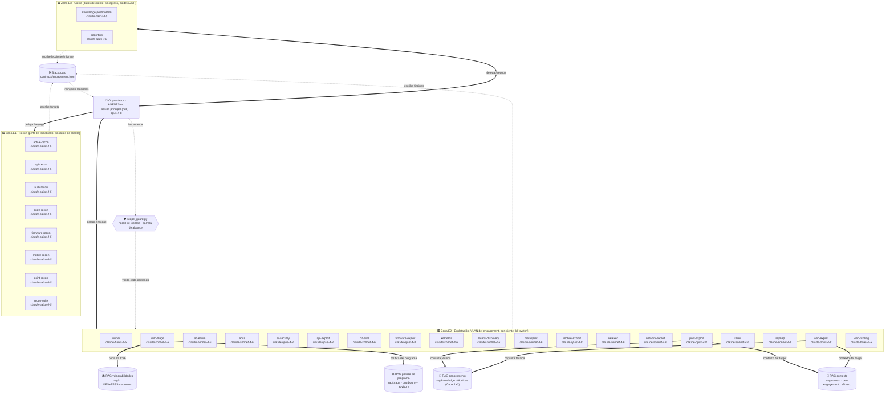

<!-- ⚠️ FICHERO AUTO-GENERADO por tools/gen_arch_diagram.py — NO editar a mano. -->
<!-- Se regenera solo (hook PostToolUse) al crear/modificar/eliminar un agente. -->

# 🗺️ Mapa de Arquitectura — Cyberseg Agents

> **Generado:** 2026-07-23 08:19:26 UTC · **Refleja el estado real** del proyecto en ese momento.
> Regenerar a mano: `python tools/gen_arch_diagram.py`

## Qué es esto (para reconstruir contexto si se pierde)

Suite de agentes para **pentesting / bug bounty autorizado**. Un **Orquestador** (sesión principal, `AGENTS.md`) coordina a los agentes especialistas mediante **hub-and-spoke**: él delega, recoge resultados y hace de **router de un bus A2A mediado** (los agentes se dirigen mensajes entre sí dejándolos en el **blackboard**, `contracts/engagement.json`; no hay malla directa). Un **hook de alcance** (`scope_guard.py`) bloquea de forma determinista cualquier comando contra un target fuera de `contracts/scope.json`. Cuatro RAG locales (SQLite/JSON) por propósito: el de **vulnerabilidades** (`rag/`, KEV+EPSS+CVE recientes) que consulta `vuln-triage`; el de **conocimiento** (`rag/knowledge/`, técnicas — Capa 1 estructurada + Capa 2 semántica, con el canon OWASP API/Web/WSTG/MASVS/MASTG/FSTM/ISVS) que consultan los agentes de explotación; el de **contexto** per-engagement (`rag/context/`, efímero y AISLADO por engagement, EN-ZONA — *qué se sabe YA de ESTE objetivo*); y el de **política de programa** (`rag/triage/`, bug bounty — do-not-report + aceptación H1/Bugcrowd/Intigriti/YWH, ADVISORY) que consultan `vuln-triage` y `reporting`.

**Estado actual:** 29 agentes especialistas (E1=8, E2=19, E3=2) + Orquestador + hook de alcance.

## Diagrama

## Las 3 zonas de aislamiento

| Zona | Propósito | Red | Datos | Riesgo |
| :--- | :--- | :--- | :--- | :--- |
| 🟦 **E1 Recon** | Mapear superficie de ataque | internet / ruta al target | sin datos de cliente | bajo |
| 🟥 **E2 Explotación** | Confirmar y explotar | **solo** VLAN del engagement, por cliente, kill-switch | acceso al target | alto |
| 🟩 **E3 Cierre** | Informe y aprendizaje | sin egress de datos crudos, ZDR | datos de cliente | medio |

## Inventario de agentes (estado real)

| Agente | Zona | Modelo | Permiso | Memoria | Tools | Función |
| :--- | :---: | :--- | :--- | :--- | :--- | :--- |
| **active-recon** | E1 | claude-haiku-4-5 | default | — | Read, Write, Edit, Grep, Glob, Bash | Recon ACTIVO / enumeración. Úsalo tras osint-recon para escanear puer… |
| **api-recon** | E1 | claude-haiku-4-5 | default | local | Read, Write, Edit, Grep, Glob, Bash | Inventario y descubrimiento de APIs (REST/GraphQL) — la spec ES el ma… |
| **auth-recon** | E1 | claude-haiku-4-5 | default | local | Read, Write, Edit, Grep, Glob, Bash | Adquisición de SESIÓN autenticada para las identidades de prueba — lo… |
| **code-recon** | E1 | claude-haiku-4-5 | default | local | Read, Grep, Glob, Write, Edit | Recon de CÓDIGO FUENTE (white-box) — el código ES el mapa de la super… |
| **firmware-recon** | E1 | claude-haiku-4-5 | default | local | Read, Write, Edit, Grep, Glob, Bash | Análisis ESTÁTICO y EMULACIÓN de firmware IoT (imagen de firmware) si… |
| **mobile-recon** | E1 | claude-haiku-4-5 | default | local | Read, Write, Edit, Grep, Glob, Bash | Inventario y análisis ESTÁTICO de apps móviles (Android APK / iOS IPA… |
| **osint-recon** | E1 | claude-haiku-4-5 | default | — | Read, Write, Edit, Grep, Glob, WebSearc… | Recon PASIVO. Úsalo al inicio de un engagement para mapear la superfi… |
| **recon-suite** | E1 | claude-haiku-4-5 | default | — | Read, Write, Edit, Grep, Glob, Bash | Especialista en el toolkit de recon moderno — subfinder, amass, dnsx,… |
| **nuclei** | E2 | claude-haiku-4-5 | default | — | Read, Write, Edit, Grep, Glob, Bash | Especialista en Nuclei (ProjectDiscovery), escaneo de vulnerabilidade… |
| **vuln-triage** | E2 | claude-sonnet-4-6 | default | local | Read, Write, Edit, Grep, Glob, Bash, We… | Análisis y priorización de vulnerabilidades. Úsalo tras active-recon … |
| **ad-enum** | E2 | claude-sonnet-4-6 | default | local | Read, Write, Edit, Grep, Glob, Bash | Especialista en reconocimiento interno de Active Directory con BloodH… |
| **adcs** | E2 | claude-sonnet-4-6 | default | local | Read, Write, Edit, Grep, Glob, Bash | Especialista en Active Directory Certificate Services (AD CS) con Cer… |
| **ai-security** | E2 | claude-opus-4-8 | default | local | Read, Write, Edit, Grep, Glob, Bash, We… | Red teaming de aplicaciones con IA/LLM. Úsalo cuando el target en sco… |
| **api-exploit** | E2 | claude-opus-4-8 | default | local | Read, Write, Edit, Grep, Glob, Bash, We… | Explotación de APIs (REST/GraphQL) siguiendo el OWASP API Security To… |
| **c2-exfil** | E2 | claude-sonnet-4-6 | default | — | Read, Write, Edit, Grep, Glob, Bash | Simulación CONTROLADA de C2, exfiltración e impacto para demostrar el… |
| **firmware-exploit** | E2 | claude-opus-4-8 | default | local | Read, Write, Edit, Grep, Glob, Bash, We… | Explotación de firmware IoT (análisis dinámico, runtime y binarios em… |
| **kerberos** | E2 | claude-sonnet-4-6 | default | local | Read, Write, Edit, Grep, Glob, Bash | Especialista en ataques Kerberos sobre Active Directory — Kerberoasti… |
| **lateral-discovery** | E2 | claude-sonnet-4-6 | default | local | Read, Write, Edit, Grep, Glob, Bash | Descubrimiento INTERNO y movimiento lateral desde un punto de apoyo c… |
| **metasploit** | E2 | claude-sonnet-4-6 | default | local | Read, Write, Edit, Grep, Glob, Bash | Operador SENIOR de Metasploit Framework. Úsalo cuando un finding trae… |
| **mobile-exploit** | E2 | claude-opus-4-8 | default | local | Read, Write, Edit, Grep, Glob, Bash, We… | Explotación de apps móviles (Android/iOS) mapeada a OWASP Mobile Top … |
| **netexec** | E2 | claude-sonnet-4-6 | default | local | Read, Write, Edit, Grep, Glob, Bash | Especialista en NetExec (nxc, sucesor de CrackMapExec) + Impacket + r… |
| **network-exploit** | E2 | claude-sonnet-4-6 | default | local | Read, Write, Edit, Grep, Glob, Bash | Explotación de servicios de red e infraestructura (no-HTTP). Úsalo pa… |
| **post-exploit** | E2 | claude-opus-4-8 | default | local | Read, Write, Edit, Grep, Glob, Bash | Post-explotación en un host ya comprometido EN SCOPE. Úsalo para esca… |
| **sliver** | E2 | claude-sonnet-4-6 | default | — | Read, Write, Edit, Grep, Glob, Bash | Operador de Sliver C2 (open source) para post-explotación y simulació… |
| **sqlmap** | E2 | claude-sonnet-4-6 | default | local | Read, Write, Edit, Grep, Glob, Bash | Especialista senior en sqlmap, automatización de inyección SQL. Úsalo… |
| **web-exploit** | E2 | claude-opus-4-8 | default | local | Read, Write, Edit, Grep, Glob, Bash, We… | Explotación de aplicaciones web (capa 7 HTTP/S) mapeada al OWASP Top … |
| **web-fuzzing** | E2 | claude-haiku-4-5 | default | local | Read, Write, Edit, Grep, Glob, Bash | Especialista en descubrimiento de contenido y fuzzing web — ffuf y fe… |
| **knowledge-postmortem** | E3 | claude-haiku-4-5 | default | project | Read, Write, Edit, Grep, Glob | Aprendizaje basado en errores. Úsalo tras cada intento o al cierre de… |
| **reporting** | E3 | claude-opus-4-8 | default | — | Read, Write, Edit, Grep, Glob | Redacción del informe del engagement. Úsalo al cierre para convertir … |

## Componentes de soporte (estado real)

- **Orquestador (hub):** `AGENTS.md` — sesión principal, no es un subagente.
- **Hook de alcance:** a2a_guard.py, a2a_router_nudge.py, approval_gate.py, blackboard_guard.py, budget_guard.py, circuit_breaker.py, fs_guard.py, header_guard.py, loop_guard.py, memory_guard.py, noise_guard.py, scope_guard.py, secret_scan.py, steering_nudge.py, subagent_stop.py, validate_blackboard.py (PreToolUse, bloquea fuera de scope).
- **Blackboard / contratos:** a2a-message.schema.json, agent-card.schema.json, agent-cards.json, engagement.json, engagement.schema.json, examples, finding.schema.json, scope.example.json, scope.json, steering-directive.schema.json, target.schema.json.
- **RAG de vulnerabilidades:** db.py, enrich_cve5.py, enrich_epss.py, enrich_exploits.py, enrich_msf.py, enrich_nuclei.py, ingest_kev.py, ingest_recent.py, query_vulns.py, refresh.py (KEV+EPSS+CVE recientes, alimenta a vuln-triage).
- **RAG de conocimiento (técnicas):** _venv.py, embed.py, ingest_atomics.py, ingest_attack.py, ingest_corpus.py, ingest_feeds.py, ingest_gtfobins.py, ingest_lolbas.py, kb.py, kb_vec.py, query_kb.py, refresh_kb.py (Capa 1 estructurada GTFOBins/LOLBAS/Atomic/ATT&CK + Capa 2 semántica HackTricks/PaTT/PEASS/817 cyber-skills/feeds; lo consultan los agentes de explotación vía la skill `rag-technique-lookup`).
- **RAG de contexto (per-engagement):** context_paths.py, ingest_context.py, query_context.py (efímero, AISLADO por engagement, EN-ZONA — *qué se sabe YA de ESTE objetivo*; reusa el embedder del RAG de conocimiento).
- **RAG de política de programa (bug bounty):** policy.py, query_triage.py (do-not-report + aceptación H1/Bugcrowd/Intigriti/YWH, dataset curado/versionado; ADVISORY — la política oficial prevalece; lo consultan `vuln-triage` y `reporting`).
- **Gobierno / coherencia:** `CONSTITUTION.md` (principios innegociables) · `tools/analyze_engagement.py` (auditoría de coherencia, `/analyze` adaptado).

## Flujo de un engagement (resumen)

1. **Init** → Orquestador lee `scope.json`, crea `engagement.json`.
2. **Recon (E1)** → `osint-recon` (pasivo) → `active-recon` (activo) escriben `targets[]`.
3. **Triage (E2)** → `vuln-triage` consulta el RAG, escribe `findings[]` priorizados.
4. **Explotación (E2)** → `web-exploit`/`network-exploit` → `post-exploit` → `lateral-discovery` → `c2-exfil`. Cada acción que toca el target requiere aprobación humana.
5. **Cierre (E3)** → `reporting` genera el informe; `knowledge-postmortem` extrae lecciones.

Detalle: ver `README.md`, `ARCHITECTURE.md` y `docs/comms-protocol.md`.
