# 🛡️ Guardarraíles — capa de seguridad de los agentes

Este documento reúne, en un solo sitio, **qué impide que los agentes hagan algo que no
deben** y lo mapea contra el [OWASP Top 10 for LLM Applications (2025)](https://owasp.org/www-project-top-10-for-large-language-model-applications/).
Es la contraparte de [`CONSTITUTION.md`](CONSTITUTION.md) (principios) y
[`ARCHITECTURE.md`](ARCHITECTURE.md) (estructura): aquí está el **control efectivo**.

Distinguimos tres clases de control, porque no todos valen lo mismo:

- **Determinista (código):** lo aplica un hook o un script, no depende del criterio de ningún
  LLM. Es el control fuerte.
- **Humano en el bucle (HITL):** aprobación humana por acción, **configurable** por el operador
  (`approval_mode`: `full`/`critical`/`auto`, def. `critical`). Las puertas DETERMINISTAS
  (alcance/presupuesto) no se relajan en ningún modo. Ver CONSTITUTION §2.
- **Mediado por LLM (soft):** una instrucción del prompt que el modelo *debería* seguir. Útil,
  pero no es una barrera.

## Modelo mental

```mermaid
flowchart TB
    UNTRUSTED["🌐 Contenido NO confiable<br/>(banners, HTML, respuestas del target,<br/>output del LLM objetivo en ai-security)"]
    AGENT["🤖 Agente especialista"]
    ORQ["🧭 Orquestador (hub)"]
    BB[("🗒️ Blackboard<br/>engagement.json")]
    TARGET["🎯 Target en scope"]

    UNTRUSTED -->|ingesta| G_INJECT
    G_INJECT -->|datos, no órdenes| AGENT
    ORQ -->|delega + valida handoff| AGENT
    AGENT -->|escribe findings/targets| G_SCHEMA
    AGENT -->|escribe findings/targets| G_REDACT
    AGENT -->|cada acción Bash| G_BUDGET
    AGENT -->|comando de escaneo| G_NOISE
    AGENT -->|acción Bash repetida| G_LOOP
    AGENT -->|comando contra target| G_SCOPE
    AGENT -->|comando ofensivo| G_HITL
    AGENT -->|mensaje A2A a otro agente| G_A2A
    AGENT -->|escribe en su memoria de aprendizaje| G_MEMORY

    subgraph GATES["Guardarraíles"]
        G_INJECT{{"🧱 datos ≠ instrucciones<br/>anti-inyección · prompt (LLM01)"}}
        G_SCOPE{{"🛡️ scope_guard.py<br/>PreToolUse · determinista"}}
        G_BUDGET{{"⏱️ budget_guard.py<br/>PreToolUse · determinista (LLM10)"}}
        G_NOISE{{"🔇 noise_guard.py<br/>PreToolUse · C18 (LLM10/§9)"}}
        G_LOOP{{"🔁 loop_guard.py<br/>PreToolUse · C19 (LLM10)"}}
        G_HITL{{"🙋 tiers de riesgo + aprobación<br/>HITL (bot)"}}
        G_PERM{{"🔒 permissions ask/deny<br/>settings.json"}}
        G_TOOLS{{"🧰 allowlist + denylist + maxTurns<br/>frontmatter por agente"}}
        G_SCHEMA{{"📐 validate_blackboard.py<br/>PostToolUse · determinista"}}
        G_REDACT{{"✂️ secret_scan.py<br/>PostToolUse · determinista (LLM02)"}}
        G_A2A{{"✉️ a2a_guard.py<br/>PostToolUse · C14/C15 (LLM01/LLM10)"}}
        G_MEMORY{{"🧠 memory_guard.py<br/>PreToolUse · determinista (LLM02)"}}
        G_FS{{"📁 fs_guard.py<br/>PreToolUse · C20 (LLM02/§1·§6)"}}
        G_BB{{"📝 blackboard_guard.py<br/>PreToolUse·Bash · C21 (LLM02)"}}
    end

    G_SCOPE -->|en scope| TARGET
    G_SCOPE -.->|fuera de scope| BLOCK["⛔ bloqueado"]
    G_BUDGET -.->|techo superado| BLOCK
    G_NOISE -.->|ruidoso/DoS-adjacent| BLOCK
    G_LOOP -.->|bucle/oscilación| BLOCK
    G_HITL -->|✅ autorizado| TARGET
    G_SCHEMA -->|válido| BB
    G_SCHEMA -.->|inválido| FIX["↩️ feedback al orquestador"]
    G_REDACT -.->|secreto del operador| FIX
    G_A2A -->|emisor/destino válidos, sin bucle| BB
    G_A2A -.->|spoofing / techo de hops| FIX
    G_MEMORY -->|técnica limpia| MEM["🧠 memoria de agente<br/>.claude/agent-memory*/"]
    G_MEMORY -.->|datos de cliente| FIX
    G_FS -->|dentro de recon/src| TARGET
    G_FS -.->|symlink/`..` fuera de la zona| BLOCK
    G_BB -.->|escritura del blackboard por Bash| BLOCK
```



## Inventario de controles (estado real)

| # | Control | Clase | Dónde | OWASP LLM 2025 |
| :--- | :--- | :--- | :--- | :--- |
| C1 | **Gate de alcance** — bloquea todo comando contra un host/IP/CIDR fuera de `scope.json` | Determinista | `.claude/hooks/scope_guard.py` (PreToolUse) | LLM06 Excessive Agency |
| C2 | **Aprobación por acción configurable** (`approval_mode` full/critical/auto, def. `critical`; 5 tiers de riesgo safe→auto … crítico→doble confirmación) | HITL configurable | `bot/intel/risk.py` + `runner.py` + `.claude/hooks/approval_gate.py` | LLM06 Excessive Agency |
| C3 | **Permisos ask/deny** (deniega leer/escribir `scope.json`; pide confirmación a nmap/sqlmap/…) | Determinista | `.claude/settings.json` → `permissions` | LLM06, **LLM07 System-prompt leakage** |
| C4 | **Mínimo privilegio por agente** — cada agente declara las tools que necesita (`tools:`), **deniega** el resto y en especial `Agent`+`Task` para no spawnear subagentes (candado hub-and-spoke; el cierre, además, sin `Bash`), y **acota sus turnos** con `maxTurns` | Determinista | frontmatter `tools:`/`disallowedTools:`/`maxTurns:` de cada agente | LLM06 Excessive Agency, **LLM10 Unbounded Consumption** |
| C5 | **Validación de esquema del blackboard** — un finding/target sin campos obligatorios dispara feedback correctivo | Determinista | `.claude/hooks/validate_blackboard.py` (PostToolUse) | **LLM05 Improper Output Handling** |
| C6 | **Escritura atómica del blackboard** — `tmp + os.replace`, evita estados a medias | Determinista | `tools/blackboard.py` | LLM05 |
| C7 | **Zonas de aislamiento E1/E2/E3** — red y datos separados por fase | Organizativo | `ARCHITECTURE.md §3` | LLM02 Sensitive Info Disclosure |
| C8 | **Regla de evidencia** — "sin fuente no se explota; sin evidencia no es un hallazgo" | Soft (LLM) | `CONSTITUTION.md`, agentes | LLM09 Misinformation |
| C9 | **Auditoría de coherencia pre-informe** — targets fuera de scope, findings sin evidencia, autorización caducada | Determinista | `tools/analyze_engagement.py` | LLM05, LLM09 |
| C10 | **Trazabilidad inmutable** — cada acción que toca un target va a `evidence[]` (ts/agente/acción/hash) | Determinista | esquema `engagement.json` | (defensa legal) |
| C11 | **Separación datos/instrucciones** — los **27** agentes que ingieren contenido del target/host comprometido (o mensajes A2A) lo tratan como DATOS, nunca como instrucciones | Soft (prompt), uniforme | bloque "Anti-inyección" en osint-recon, recon-suite, active-recon, api-recon, code-recon, auth-recon, mobile-recon, firmware-recon, vuln-triage, nuclei, web-exploit, web-fuzzing, sqlmap, api-exploit, network-exploit, metasploit, ai-security, mobile-exploit, firmware-exploit, ad-enum, adcs, kerberos, netexec, post-exploit, lateral-discovery, sliver, c2-exfil (todos salvo reporting/knowledge-postmortem, que no ingieren contenido del target) | **LLM01 Prompt Injection** |
| C12 | **Detector de secretos del operador** — bloquea si una clave del motor/operador (privada, `sk-ant`, token del bot) aparece en el blackboard; `redact()` además sanea el informe | Determinista | `tools/redactor.py` + `.claude/hooks/secret_scan.py` (PostToolUse) | **LLM02 Sensitive Info Disclosure** |
| C13 | **Kill-switch de consumo** — cuenta las acciones Bash por engagement y bloquea al superar el techo (`constraints.max_actions`, def. 1000) | Determinista | `.claude/hooks/budget_guard.py` (PreToolUse) | **LLM10 Unbounded Consumption** |
| C14 | **Validador del bus A2A** — cada mensaje agente→agente debe tener envelope sano y `from_agent`/`to_agent` que sean agentes conocidos (registro `agent-cards.json`); rechaza emisor/destino inventado (anti-spoofing) y exige que `to_agent` sea un **peer declarado** de `from_agent` (topología `a2a_peers`) o el hub — los relevos fuera de pareja van por el Orquestador. Los mensajes A2A se tratan como DATOS (la regla soft es C11) | Determinista | `.claude/hooks/a2a_guard.py` (PostToolUse) | **LLM01 Prompt Injection** |
| C15 | **Kill-switch A2A** — acota la conversación entre agentes: bloquea si los mensajes del engagement superan el techo o si una cadena acumula demasiados `hops` (anti-bucle). Equivalente A2A de C13 (`constraints.max_a2a_hops`, def. 50) | Determinista | `.claude/hooks/a2a_guard.py` (PostToolUse) | **LLM10 Unbounded Consumption** |
| C16 | **Auditoría del ciclo de subagentes** — cada fin de subagente deja un registro JSONL inmutable por anexado (agente, id, sesión, engagement, transcript). **Observacional**: no bloquea la finalización (fail-safe a exit 0) | Determinista (audit) | `.claude/hooks/subagent_stop.py` (SubagentStop) → `engagements/<id>/evidence/subagents.jsonl` (o `.claude/audit/`) | (trazabilidad / defensa legal) |
| C17 | **Guard de sanitización de la memoria de aprendizaje** — antes de escribir en la memoria persistente de un agente (`.claude/agent-memory*/`: `local` per-operador **y** `project` compartida por git) **bloquea** si el contenido trae secretos, identificadores del scope (IPs/dominios in/out), IPs públicas enrutables o loot (hashes). Convierte "sin datos de cliente en memoria" en garantía de código (aislamiento de cliente, CONSTITUTION §1) | Determinista | `.claude/hooks/memory_guard.py` (PreToolUse) + `tools/redactor.py` + helpers de `scope_guard` | **LLM02 Sensitive Info Disclosure** |
| C18 | **Anti-alboroto** — bloquea el escaneo ruidoso/DoS-adjacent (`nmap -T5`, `masscan`/`zmap` sin `--rate` o sobre el cap, `rustscan` con `--batch-size`/`--ulimit` excesivos, fuerza bruta con demasiados hilos, fuzzing web con cientos de hilos); en modo `stealth` endurece (`-T4`/`-A`/`-p-` rápido, rustscan sin acotar). Configurable: `constraints.allow_noisy` lo desactiva si la ROE autoriza ruido; `stealth`/`max_scan_rate` ajustan umbrales. Aplica CONSTITUTION §9 (bajo ruido) | Determinista | `.claude/hooks/noise_guard.py` (PreToolUse) | **LLM10 Unbounded Consumption** (+ no-daño §5/§9) |
| C19 | **Anti-bucle (nivel de acción)** — detecta el mismo comando repetido (thrashing) y la oscilación A/B sin progreso, y **bloquea** tras `constraints.max_repeat` (def. 3) en la ventana reciente. Obliga a cambiar de hipótesis o escalar. Complementa C13 (kill-switch global de acciones) y C15 (techo de hops A2A) llevándolo al nivel de ACCIÓN | Determinista | `.claude/hooks/loop_guard.py` (PreToolUse) | **LLM10 Unbounded Consumption** |
| C21 | **Anti-escritura del blackboard por Bash** — bloquea los patrones comunes de mutación de `contracts/engagement.json` vía Bash (redirección `>`/`>>`, `tee`, `sed -i`, `cp`/`mv`/`dd`/`install`/`truncate`, `open(...,'w')`/`​.write()` de Python), forzando que toda mutación pase por las tools `Write`/`Edit` — que SÍ están gateadas por `validate_blackboard`/`secret_scan`/`a2a_guard`. Cierra el hueco (councils A y D) de un agente con `Bash` (p.ej. `auth-recon`) volcando un secreto al blackboard esquivando los guards de secreto. Contrato consciente (no un sandbox: la ofuscación se contiene con el contenedor efímero de C); LEER el blackboard no se bloquea | Determinista | `.claude/hooks/blackboard_guard.py` (PreToolUse·Bash) | **LLM02 Sensitive Info Disclosure** (+ integridad del blackboard) |
| C20 | **Confinamiento de lectura de código de cliente** — bloquea una lectura cuando (a) su destino real cae bajo `~/.claude` (credenciales del operador), (b) el **ancla** `recon/src` es un symlink que resuelve fuera del repo, (c) un **symlink** o un `..` escapa del árbol de código de cliente (`engagements/<id>/recon/src/`), o (d) un symlink interno del repo escapa del repo. Verifica el `file_path` de cada `Read` y la **ruta-consulta** (`path`) de `Grep`/`Glob`; el recorrido profundo de Grep/Glob no sigue symlinks por defecto (ripgrep) y su confinamiento DURO lo aporta el contenedor. Cierra el hueco de FS que dejó `code-recon` (mejora "A"); el **contenedor efímero por-engagement** (`deploy/engagement-run.sh`, monta solo ese engagement, sin egress) da el confinamiento por namespace de montaje (mejora "C") | Determinista | `.claude/hooks/fs_guard.py` (PreToolUse) + `deploy/engagement-run.sh` / `docker-compose.engagement.yml` | **LLM02 Sensitive Info Disclosure** (+ aislamiento §1/§6) |

> **Refuerzo del router A2A (no es un gate):** `a2a_router_nudge.py` (PostToolUse sobre `Task`)
> recuerda al Orquestador, tras cada retorno de subagente, que entregue los mensajes A2A `pending`
> del blackboard (inyecta la lista por `additionalContext`). No bloquea nada: convierte el ciclo
> del router de "instrucción de prompt" en un recordatorio determinista para que no se pierda
> ningún relevo (trazabilidad C10).

## Dónde corren los controles (repo vs plugin)

Los guardarraíles deterministas se activan a **nivel de repo** vía `.claude/settings.json`
(hooks `scope_guard`, `budget_guard`, `validate_blackboard` y `secret_scan`) — es el despliegue
real en la Kali, y cubre tanto la CLI `claude` como el bot (que dispara los mismos hooks del
proyecto). El **plugin** de VS Code, en cambio, empaqueta **solo `scope_guard`** (C1): es el
único portable. Los otros tres están acoplados a rutas del repo (`contracts/`, `tools/`) y no
tendrían sentido fuera de él. **No es una incongruencia**: el plugin es un atajo de distribución;
la postura de seguridad completa vive en el repo desplegado.

## Brechas conocidas — ahora cubiertas

Honestidad por delante: estos tres vectores estaban **sin control determinista**; desde jun 2026
ya tienen uno cada uno (C11, C12 y C13 respectivamente). Queda un residual de *fase 2* anotado en
la última columna.

| Brecha | OWASP | Por qué nos afecta | Mitigación implementada | Estado |
| :--- | :--- | :--- | :--- | :--- |
| **Prompt injection desde el target** | **LLM01** | Los agentes ingieren contenido no confiable (banners, HTML, y en `ai-security` el output del LLM objetivo). Un target malicioso puede intentar inyectar instrucciones. `scope_guard` mitiga que *toque* algo fuera de scope, pero no que filtre datos locales. | **C11**: bloque de separación datos/instrucciones en los 27 agentes que ingieren contenido | ✅ C11 (soft) · fase 2 = clasificador local tipo Prompt Guard |
| **Fuga de secretos en evidencia/informe** | **LLM02** | La redacción de credenciales era mediada por LLM (C8). E3-ZDR es organizativo, no forzado por código. | **C12**: `redactor.py` + hook `secret_scan.py` que bloquea claves del operador en el blackboard y sanea el informe | ✅ C12 (determinista) |
| **Consumo no acotado / kill-switch** | **LLM10 Unbounded Consumption** | No había límite de iteraciones/coste por engagement en código (relevante con cupo Pro). El kill-switch era conceptual. | **C13**: `budget_guard.py` cuenta acciones Bash por engagement y bloquea al superar el techo | ✅ C13 (determinista) · fase 2 = `task_budget` del bot |

> **Criterio de diseño:** replicamos la *idea* de los frameworks del sector (NeMo Guardrails,
> Guardrails AI, LLM Guard, Llama Guard / Prompt Guard) con controles **ligeros y stdlib**, en
> hooks, sin meter un runtime de guardrails que choque con el modelo "todo sobre Claude Code".
> Un clasificador local (Prompt Guard 2 / Llama Guard 4) es opción de fase 2 — encaja con el
> gusto por lo offline, pero compite por los 15 GB de RAM.

## Cómo verificar que los guardarraíles están activos

```bash
python tools/validate_suite.py     # comprueba que los hooks referenciados existen
python dryrun/run_dryrun.py        # ejercita scope_guard + budget_guard + validación de esquema + secret_scan
python tools/redactor.py <fichero> # escanea un fichero en busca de secretos (sale 1 si hay)
```

El `dryrun` lanza comandos in-scope y out-of-scope reales contra `scope_guard.py`, comandos de
sobra para disparar el `budget_guard.py`, ejercita el bus A2A (`a2a_guard.py`, C14/C15) y los
guardarraíles **anti-alboroto** (`noise_guard.py`, C18) y **anti-bucle** (`loop_guard.py`, C19) en
sandbox, y valida el `engagement.json` resultante contra los esquemas (incluida la pasada de
`secret_scan.py`): si un control se rompe, salta ahí.
