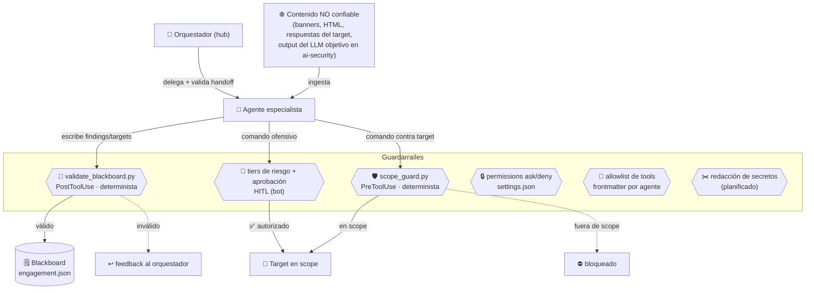

# 🛡️ Guardarraíles — capa de seguridad de los agentes

Este documento reúne, en un solo sitio, **qué impide que los agentes hagan algo que no
deben** y lo mapea contra el [OWASP Top 10 for LLM Applications (2025)](https://owasp.org/www-project-top-10-for-large-language-model-applications/).
Es la contraparte de [`CONSTITUTION.md`](CONSTITUTION.md) (principios) y
[`ARCHITECTURE.md`](ARCHITECTURE.md) (estructura): aquí está el **control efectivo**.

Distinguimos tres clases de control, porque no todos valen lo mismo:

- **Determinista (código):** lo aplica un hook o un script, no depende del criterio de ningún
  LLM. Es el control fuerte.
- **Humano en el bucle (HITL):** una persona aprueba antes de actuar.
- **Mediado por LLM (soft):** una instrucción del prompt que el modelo *debería* seguir. Útil,
  pero no es una barrera.

## Modelo mental



## Inventario de controles (estado real)

| # | Control | Clase | Dónde | OWASP LLM 2025 |
| :--- | :--- | :--- | :--- | :--- |
| C1 | **Gate de alcance** — bloquea todo comando contra un host/IP/CIDR fuera de `scope.json` | Determinista | `.claude/hooks/scope_guard.py` (PreToolUse) | LLM06 Excessive Agency |
| C2 | **Aprobación por acción con 5 tiers de riesgo** (safe→auto … C2/crítico→doble confirmación) | HITL | `bot/intel/risk.py` + `runner.py` | LLM06 Excessive Agency |
| C3 | **Permisos ask/deny** (deniega leer/escribir `scope.json`; pide confirmación a nmap/sqlmap/…) | Determinista | `.claude/settings.json` → `permissions` | LLM06, **LLM07 System-prompt leakage** |
| C4 | **Mínimo privilegio de tools** — cada agente declara solo las tools que necesita | Determinista | frontmatter `tools:` de cada agente | LLM06 Excessive Agency |
| C5 | **Validación de esquema del blackboard** — un finding/target sin campos obligatorios dispara feedback correctivo | Determinista | `.claude/hooks/validate_blackboard.py` (PostToolUse) | **LLM05 Improper Output Handling** |
| C6 | **Escritura atómica del blackboard** — `tmp + os.replace`, evita estados a medias | Determinista | `tools/blackboard.py` | LLM05 |
| C7 | **Zonas de aislamiento E1/E2/E3** — red y datos separados por fase | Organizativo | `ARCHITECTURE.md §3` | LLM02 Sensitive Info Disclosure |
| C8 | **Regla de evidencia** — "sin fuente no se explota; sin evidencia no es un hallazgo" | Soft (LLM) | `CONSTITUTION.md`, agentes | LLM09 Misinformation |
| C9 | **Auditoría de coherencia pre-informe** — targets fuera de scope, findings sin evidencia, autorización caducada | Determinista | `tools/analyze_engagement.py` | LLM05, LLM09 |
| C10 | **Trazabilidad inmutable** — cada acción que toca un target va a `evidence[]` (ts/agente/acción/hash) | Determinista | esquema `engagement.json` | (defensa legal) |

## Brechas conocidas y plan

Honestidad por delante: estos vectores **aún no** están cubiertos por un control determinista.

| Brecha | OWASP | Por qué nos afecta | Mitigación propuesta | Estado |
| :--- | :--- | :--- | :--- | :--- |
| **Prompt injection desde el target** | **LLM01** | Los agentes ingieren contenido no confiable (banners, HTML, y en `ai-security` el output del LLM objetivo). Un target malicioso puede intentar inyectar instrucciones. `scope_guard` mitiga que *toque* algo fuera de scope, pero no que filtre datos locales. | Separación datos/instrucciones en el prompt de los agentes que ingieren contenido + (fase 2) clasificador local tipo Prompt Guard | Pendiente |
| **Fuga de secretos en evidencia/informe** | **LLM02** | La redacción de credenciales es hoy mediada por LLM (C8). E3-ZDR es organizativo, no forzado por código. | Redactor de secretos determinista (regex tipo gitleaks) antes de escribir `evidence[]`/informe (C6 ya da el punto de enganche) | Pendiente |
| **Consumo no acotado / kill-switch** | **LLM10 Unbounded Consumption** | No hay límite de iteraciones/tokens/coste por engagement en código (relevante con cupo Pro). El kill-switch es conceptual. | `task_budget` (Opus 4.8) en el bot + contador de iteraciones en el blackboard | Pendiente |

> **Criterio de diseño:** replicamos la *idea* de los frameworks del sector (NeMo Guardrails,
> Guardrails AI, LLM Guard, Llama Guard / Prompt Guard) con controles **ligeros y stdlib**, en
> hooks, sin meter un runtime de guardrails que choque con el modelo "todo sobre Claude Code".
> Un clasificador local (Prompt Guard 2 / Llama Guard 4) es opción de fase 2 — encaja con el
> gusto por lo offline, pero compite por los 15 GB de RAM.

## Cómo verificar que los guardarraíles están activos

```bash
python tools/validate_suite.py     # comprueba que los hooks referenciados existen
python dryrun/run_dryrun.py        # ejercita scope_guard + validación de esquema end-to-end
```

El `dryrun` lanza comandos in-scope y out-of-scope reales contra `scope_guard.py` y valida el
`engagement.json` resultante contra los esquemas: si un control se rompe, salta ahí.
