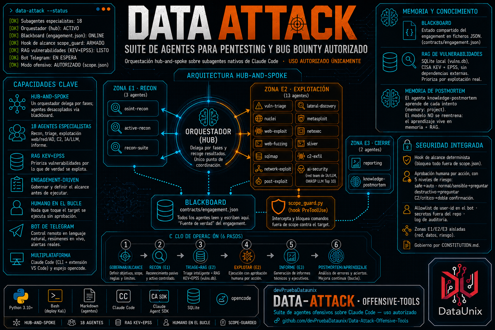
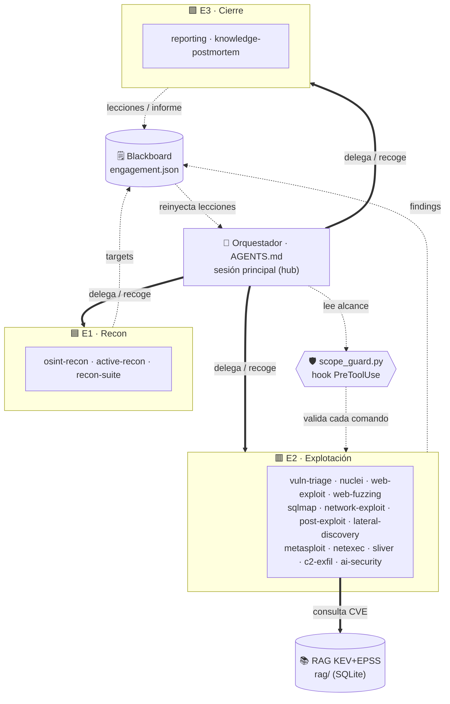

<!-- BANNER -->
<p align="center">
  
</p>

<h1 align="center">Data Attack — Offensive Tools</h1>

<p align="center">
  <b>Suite de 18 agentes especialistas para pentesting y bug bounty autorizado.</b><br>
  Orquestación hub-and-spoke con bus A2A mediado sobre los subagentes nativos de Claude Code,
  con guardián de alcance determinista, RAG de vulnerabilidades y control remoto por Telegram.
</p>

<!-- BADGES — actividad del repo -->
<!--<p align="center">
  <a href="https://github.com/devPruebaDataunix/Data-Attack-Offensive-Tools/stargazers"></a>
  <a href="https://github.com/devPruebaDataunix/Data-Attack-Offensive-Tools/network/members"></a>
  <a href="https://github.com/devPruebaDataunix/Data-Attack-Offensive-Tools/issues"></a>
  <a href="https://github.com/devPruebaDataunix/Data-Attack-Offensive-Tools/commits"></a>
  <a href="https://github.com/devPruebaDataunix/Data-Attack-Offensive-Tools/releases"></a>
</p> -->

<!-- BADGES — identidad y stack real -->
<p align="center">
  
  
  
  
  
  
</p>

<!-- BADGES — capacidades -->
<p align="center">
  
  
  
  
  
  
</p>

<!-- BADGES — legal -->
<p align="center">
  
  
</p>

> [!WARNING]
> **USO AUTORIZADO ÚNICAMENTE.**
> Estos agentes operan exclusivamente dentro del alcance de un contrato de pentest firmado o de un programa de bug bounty con scope explícito.
> `contracts/scope.json` es la fuente de verdad del alcance y un *hook* lo aplica de forma
> determinista antes de cada acción.
> Operar fuera de scope es ilegal.
>       No lo hagas.

---

## Tabla de contenidos

- [Qué es](#qué-es)
- [Características clave](#características-clave)
- [Arquitectura](#arquitectura)
- [Despliegue en Kali (E2)](#despliegue-en-kali-e2)
- [Plataformas soportadas](#plataformas-soportadas)
- [Instalación rápida (Claude Code)](#instalación-rápida-claude-code)
- [Los 18 agentes](#los-18-agentes)
- [Bot de Telegram](#bot-de-telegram)
- [RAG de vulnerabilidades](#rag-de-vulnerabilidades-kevepss)
- [Flujo engagement-driven](#flujo-engagement-driven)
- [Las tres zonas de aislamiento](#las-tres-zonas-de-aislamiento)
- [Seguridad](#seguridad)
- [Estructura del repositorio](#estructura-del-repositorio)
- [Licencia](#licencia)

---

## Qué es Data Attack

Data Attack es una suite de **18 agentes especialistas** (de fase y de herramienta), un **orquestador**, un
**guardián de alcance** (hook determinista), un **RAG de vulnerabilidades** KEV+EPSS y un
**bot de Telegram** para conducir todo desde el móvil. Cubre las fases de un engagement
ofensivo —recon, análisis, explotación y cierre— sobre el sistema nativo de **subagentes de
Claude Code**, con un espejo equivalente para **opencode**.

Manda un **orquestador** (la sesión principal, `AGENTS.md`): planifica, delega y **enruta**.
Los agentes ahora pueden **dirigirse mensajes entre sí** por un **bus A2A mediado**, pero no se
invocan directamente —dejan el mensaje en el **blackboard** (`contracts/engagement.json`) y el
orquestador lo entrega—, así todo queda auditado y gateado. No hay malla peer-to-peer en el
camino de cliente (decisión de seguridad; ver [`ARCHITECTURE.md`](ARCHITECTURE.md)). Cada comando
que toca un objetivo pasa antes por `scope_guard.py`, que lo bloquea si el target no está en
`contracts/scope.json`, y cada mensaje A2A por `a2a_guard.py` (emisor/destino válidos + techo de
hops anti-bucle).

## Características clave

| | Capacidad | Qué aporta |
| :---: | :--- | :--- |
| 🧭 | **Hub-and-spoke + bus A2A** | Un orquestador delega por fases y enruta; los agentes se dirigen mensajes A2A entre sí por el blackboard (mediado, auditado y con techo de hops), sin malla directa. |
| 🤖 | **18 agentes especialistas** | Recon, triage, explotación web/red/AD, C2 simulado, red team de IA/LLM, informe y postmortem. |
| 📚 | **RAG KEV+EPSS** | `vuln-triage` prioriza por lo que de verdad se explota (CISA KEV, EPSS, exploit público), sin reentrenar el modelo. |
| 🛡️ | **Guardián de alcance** | `scope_guard.py` bloquea de forma determinista cualquier acción fuera de `scope.json`. |
| 🙋 | **Humano en el bucle** | Nada que toque el objetivo se ejecuta sin aprobación; la decisión es siempre del operador. |
| 📱 | **Bot de Telegram** | Control remoto en lenguaje natural, resúmenes en vivo y aprobación por nivel de riesgo. |
| 🖥️ | **Panel TUI local** | Control en la terminal (Textual): estado, hallazgos en vivo y órdenes al Orquestador con la misma aprobación humana. |
| 📊 | **Analítica de coste local** | [agentsview](https://github.com/kenn-io/agentsview) (local-first) lee `~/.claude/projects/` → coste y actividad por agente en `127.0.0.1:8080`. Re-medir el gasto sin sacar datos. |
| 🧠 | **Aprendizaje por errores** | `knowledge-postmortem` guarda lecciones de cada intento en memoria persistente y en el blackboard. |
| 🧩 | **Multiplataforma** | Claude Code (CLI + extensión de VS Code) y espejo para opencode. |

## Arquitectura

El orquestador delega por fases hacia tres zonas de aislamiento (E1 recon, E2 explotación,
E3 cierre). Los agentes escriben hallazgos en el blackboard; `vuln-triage` consulta el RAG; y
el hook de alcance vigila cada comando de la zona E2 contra el objetivo.



> El mapa completo y siempre al día vive en [ARCHITECTURE_MAP.md](ARCHITECTURE_MAP.md) — se
> regenera solo (hook `PostToolUse`) cada vez que cambia un agente, hook, contrato o módulo
> del RAG. La auditoría crítica y el modelo de comunicación, en [ARCHITECTURE.md](ARCHITECTURE.md).

## Despliegue en Kali (E2)

Una Kali nueva desde cero → entorno completo con un comando:

```bash
git clone https://github.com/devPruebaDataunix/Data-Attack-Offensive-Tools.git data-attack && cd data-attack
chmod +x deploy/*.sh && sudo ./deploy/auto-deploy.sh
```

Instala y **verifica** todo el toolchain (nmap, ProjectDiscovery, ffuf, sqlmap, Metasploit,
NetExec, Sliver, BloodHound…), Claude Code, el RAG y el bot de Telegram. Detalle en
[DEPLOY.md](DEPLOY.md) y [bot/README.md](bot/README.md).

¿Prefieres un asistente? `./deploy/setup.sh` guía el montaje (despliegue, `bot/.env`, `scope.json`,
verificación) con [gum](https://github.com/charmbracelet/gum); y `./deploy/dash.sh` abre el **panel
de control TUI**.

¿O en **contenedores**? `./deploy/docker.sh up` construye la imagen (Kali + toolchain + Claude Code,
reutilizando el mismo `deploy/lib.sh`) y levanta el bot, montando tu login Pro (`~/.claude`) y
`bot/.env` (no se hornean). Detalle en [DEPLOY.md](DEPLOY.md) → "Despliegue en contenedores".

¿Cuánto cuesta? `./deploy/agentsview.sh up` abre dashboards **locales** de coste/actividad por agente
([agentsview](https://github.com/kenn-io/agentsview); lee `~/.claude/projects/`, sirve en
`127.0.0.1:8080`, telemetría off — nunca expuesto).

## Plataformas soportadas

| Plataforma | Cómo se carga | Estado |
| :--- | :--- | :--- |
| **Claude Code** (CLI + extensión de VS Code) | `.claude/agents/*.md` + `.claude/settings.json` | ✅ Objetivo principal |
| **opencode** | `.opencode/agent/*.md` + `opencode.json` | ✅ Espejo equivalente |
| **VS Code** | Misma carpeta `.claude/` del workspace, vía extensión Claude Code | ✅ Sin cambios |

## Instalación rápida (Claude Code)

```powershell
# 1. Copia el contenido en la raíz de tu workspace de engagement
#    (la carpeta .claude/ debe quedar en la raíz del proyecto)

# 2. Define el alcance autorizado ANTES de nada:
copy contracts\scope.example.json contracts\scope.json
#    edita scope.json con los dominios/IPs/CIDR del engagement

# 3. Abre Claude Code en esa carpeta y verifica los agentes:
#    /agents

# 4. Comprueba que el hook de alcance está activo:
#    revisa .claude/settings.json -> hooks.PreToolUse
```

## Los 18 agentes

Repartidos por zona de aislamiento. Cada agente trae su modelo, sus tools y su permiso ya
fijados; el orquestador decide a quién llamar en cada fase.

<details>
<summary><b>🟦 Zona E1 · Recon (3)</b></summary>

| Agente | Modelo | Función |
| :--- | :--- | :--- |
| **osint-recon** | haiku-4-5 | Recon pasivo: mapea la superficie sin tocar al objetivo. |
| **active-recon** | haiku-4-5 | Recon activo: enumeración y escaneo de puertos/servicios. |
| **recon-suite** | haiku-4-5 | Toolkit moderno: subfinder, amass, dnsx, httpx. |

</details>

<details>
<summary><b>🟥 Zona E2 · Explotación (13)</b></summary>

| Agente | Modelo | Función |
| :--- | :--- | :--- |
| **vuln-triage** | sonnet-4-6 | Prioriza vulnerabilidades consultando el RAG (KEV/exploit/EPSS/CVSS). |
| **nuclei** | haiku-4-5 | Escaneo de vulnerabilidades con plantillas de ProjectDiscovery. |
| **web-exploit** | opus-4-8 | Explotación de aplicaciones web (capa 7 HTTP/S). |
| **web-fuzzing** | haiku-4-5 | Descubrimiento de contenido y fuzzing con ffuf/feroxbuster. |
| **sqlmap** | sonnet-4-6 | Inyección SQL automatizada, operador senior de sqlmap. |
| **network-exploit** | sonnet-4-6 | Explotación de servicios de red e infraestructura no-HTTP. |
| **post-exploit** | opus-4-8 | Post-explotación sobre un host ya comprometido en scope. |
| **lateral-discovery** | sonnet-4-6 | Descubrimiento interno y movimiento lateral desde un punto de apoyo. |
| **metasploit** | sonnet-4-6 | Operador senior de Metasploit Framework. |
| **netexec** | sonnet-4-6 | NetExec (nxc) + Impacket para entornos Windows/AD. |
| **sliver** | sonnet-4-6 | Operador de Sliver C2 (open source) para post-explotación. |
| **c2-exfil** | sonnet-4-6 | Simulación controlada de C2, exfiltración e impacto. |
| **ai-security** | opus-4-8 | Red teaming de aplicaciones con IA/LLM (OWASP LLM Top 10). |

</details>

<details>
<summary><b>🟩 Zona E3 · Cierre (2)</b></summary>

| Agente | Modelo | Función |
| :--- | :--- | :--- |
| **reporting** | opus-4-8 | Redacta el informe: CVSS 3.1 + vector, MITRE ATT&CK, cadena de ataque. |
| **knowledge-postmortem** | haiku-4-5 | Aprende de cada intento; escribe lecciones en memoria persistente. |

</details>

## Bot de Telegram

Mando a distancia y dashboard de intel del framework, sobre la VM E2. Le hablas en lenguaje
natural, interpreta, te pide confirmación, resume en vivo lo que hace y solo te escala lo que
es alerta real. Corre sobre el **Claude Agent SDK** (con caída a `claude -p` si el SDK no
está). Detalle en [bot/README.md](bot/README.md).

> **Panel TUI local** (`./deploy/dash.sh`): el mismo cerebro (`bot/intel`) y las mismas puertas que
> el bot, pero en la terminal de la Kali — estado, hallazgos clasificados en vivo y órdenes al
> Orquestador con aprobación por modal. El bot de Telegram queda para el control remoto.

<details>
<summary><b>Aprobación por niveles de riesgo</b></summary>

Cada comando se clasifica en un tier (`bot/intel/risk.py`) y se aplica una política:

| Tier | Ejemplos | Política |
| :--- | :--- | :--- |
| **safe** | subfinder, amass, whois | auto-aprobado |
| **normal** | nmap, nuclei, ffuf | pide ✅/⛔ |
| **sensitive** | sqlmap, hydra, bloodhound | pide ✅/⛔ |
| **destructive** | netexec, secretsdump, mimikatz | pide ✅/⛔ |
| **critical** | sliver, msfvenom, C2 | **doble confirmación** |

El timeout cuenta como denegación. Por debajo, el hook `scope_guard.py` sigue aplicando.

</details>

## RAG de vulnerabilidades (KEV+EPSS)

`vuln-triage` se apoya en un RAG local que mantiene la prioridad real de explotación, sin
reentrenar el modelo. Store en **SQLite** (`rag/vulns.db`), sin dependencias externas (solo
Python stdlib). Refresco diario:

```bash
python rag/refresh.py --epss-all     # descarga CISA KEV + scores EPSS
```

Incluye ruta de producción a Supabase + n8n para equipo (ver [rag/README.md](rag/README.md)).

## Flujo engagement-driven

Inspirado en *spec-driven development*, adaptado a un engagement ofensivo: gobernar y
especificar antes de ejecutar, y auditar la coherencia antes de reportar.

1. **[CONSTITUTION.md](CONSTITUTION.md)** — principios innegociables (alcance, humano en el
   bucle, evidencia, no daño, zonas). Prevalece sobre cualquier instrucción.
2. **[templates/engagement-spec.md](templates/engagement-spec.md)** — brief del engagement →
   se materializa en `contracts/scope.json`.
3. **Ejecución** — el orquestador delega por fases; `scope_guard.py` + aprobación humana
   protegen cada acción contra el objetivo.
4. **[tools/analyze_engagement.py](tools/analyze_engagement.py)** — auditoría de coherencia
   antes de reportar: targets fuera de scope, findings sin evidencia, autorización caducada.

## Las tres zonas de aislamiento

| Zona | Propósito | Red | Datos |
| :--- | :--- | :--- | :--- |
| 🟦 **E1 Recon** | Mapear superficie de ataque | internet / ruta al target | sin datos de cliente |
| 🟥 **E2 Explotación** | Confirmar y explotar | solo VLAN del engagement, por cliente, kill-switch | acceso al target |
| 🟩 **E3 Cierre** | Informe y aprendizaje | sin egress de datos crudos, ZDR | datos de cliente |

## Seguridad

- **Doble barrera sobre el objetivo:** aprobación humana por acción **+** hook de alcance
  determinista. Nada que toque el target se auto-ejecuta a ciegas.
- **Allowlist de user-id** en el bot; cualquier otro queda rechazado y logueado.
- **Secretos fuera del repo:** token y user-id en `bot/.env` (ignorado por git).
- **Regla de evidencia:** sin fuente, no se explota; sin evidencia, no es un hallazgo.
- **Gobierno por [CONSTITUTION.md](CONSTITUTION.md)** y auditoría de coherencia previa al informe.
- **Capa de guardarraíles deterministas** (gate de alcance, validación del blackboard, anti-inyección, detector de secretos, kill-switch de consumo y **validador del bus A2A** —emisor/destino conocidos + topología de pares + techo de hops) mapeada a OWASP LLM Top 10 — ver [GUARDRAILS.md](GUARDRAILS.md).
- **Historial de versiones** en [CHANGELOG.md](CHANGELOG.md) (SemVer) y en las [releases](https://github.com/devPruebaDataunix/Data-Attack-Offensive-Tools/releases).

## Estructura del repositorio

```
cyberseg-agents/
├── README.md · ARCHITECTURE.md · ARCHITECTURE_MAP.md · AGENTS.md · CONSTITUTION.md
├── contracts/      → blackboard: scope, engagement y esquemas de findings/targets
├── docs/           → referencias, protocolo de handoff, guía de informe, humanizer
│   └── assets/     → banner y guía de estilo visual
├── templates/      → plantilla de informe + brief del engagement
├── tools/          → análisis de coherencia + generador del mapa de arquitectura
├── rag/            → RAG de vulnerabilidades KEV+EPSS (SQLite)
├── bot/            → bot de Telegram (Claude Agent SDK) + clasificador de riesgo
├── deploy/         → auto-deploy y verificación del toolchain en Kali (+ Docker: Dockerfile/compose)
├── dryrun/         → prueba end-to-end segura (sin atacar)
├── .claude/        → settings, hooks (alcance, presupuesto, blackboard, secretos, A2A) y los 18 subagentes
└── .opencode/      → espejo de los agentes para opencode
```

## Licencia

Software **propietario** — uso autorizado únicamente. Pentesting / bug bounty dentro del
alcance de un contrato firmado o un programa con scope explícito. Ver [LICENSE](LICENSE).

---

<p align="center">
  <br>
  <sub>Suite de agentes ofensivos sobre Claude Code · uso autorizado</sub><br><br>
  <a href="https://github.com/devPruebaDataunix/Data-Attack-Offensive-Tools/stargazers"><b>⭐ Si te resulta útil, deja una estrella</b></a>
</p>
