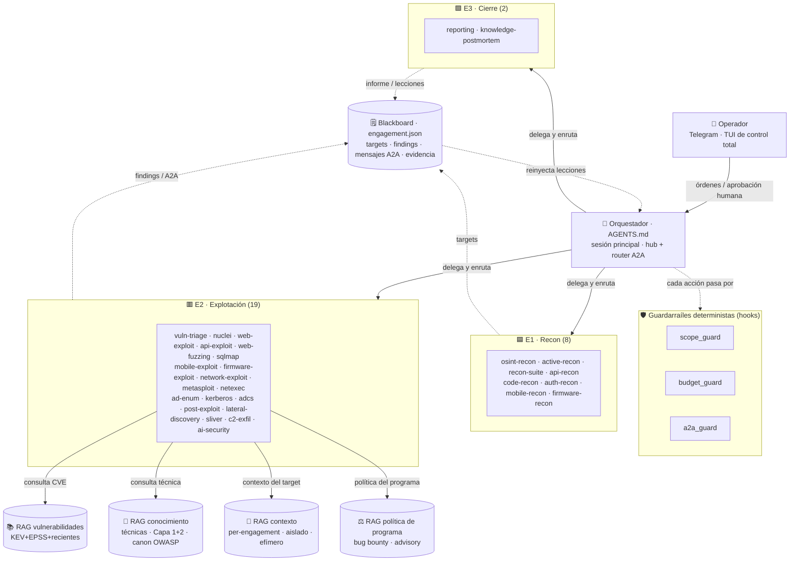

<!-- BANNER -->
<p align="center">
  
</p>

<h1 align="center">Data Attack — Offensive Tools</h1>

<p align="center">
  <b>Suite de 29 agentes especialistas para pentesting y bug bounty autorizado.</b><br>
  Orquestación hub-and-spoke con bus A2A mediado sobre los subagentes nativos de Claude Code,
  con guardián de alcance determinista, cuatro RAG locales (vulnerabilidades · conocimiento ofensivo · contexto per-engagement · política de programa) y
  control remoto por Telegram.
</p>

<!-- BADGES — actividad del repo -->
<!--<p align="center">
  <a href="https://github.com/devPruebaDataunix/Data-Attack-Offensive-Tools/stargazers"></a>
  <a href="https://github.com/devPruebaDataunix/Data-Attack-Offensive-Tools/network/members"></a>
  <a href="https://github.com/devPruebaDataunix/Data-Attack-Offensive-Tools/issues"></a>
  <a href="https://github.com/devPruebaDataunix/Data-Attack-Offensive-Tools/commits"></a>
  <a href="https://github.com/devPruebaDataunix/Data-Attack-Offensive-Tools/releases"></a>
</p> -->

<!-- BADGES — identidad y stack real -->
<p align="center">
  
  
  
  
  
  
</p>

<!-- BADGES — capacidades -->
<p align="center">
  
  
  
  
  
  
  
</p>

<!-- BADGES — legal -->
<p align="center">
  
  
</p>

> [!WARNING]
> **USO AUTORIZADO ÚNICAMENTE.**
> Estos agentes operan exclusivamente dentro del alcance de un contrato de pentest firmado o de un programa de bug bounty con scope explícito.
> `contracts/scope.json` es la fuente de verdad del alcance y un *hook* lo aplica de forma
> determinista antes de cada acción.
> Operar fuera de scope es ilegal.
>       No lo hagas.

---

## Tabla de contenidos

- [Qué es](#qué-es)
- [Características clave](#características-clave)
- [Arquitectura](#arquitectura)
- [Despliegue en Kali (E2)](#despliegue-en-kali-e2)
- [Actualizar](#actualizar)
- [Plataformas soportadas](#plataformas-soportadas)
- [Instalación rápida (Claude Code)](#instalación-rápida-claude-code)
- [Los 29 agentes](#los-29-agentes)
- [Bot de Telegram](#bot-de-telegram)
- [Los cuatro RAG locales](#los-cuatro-rag-locales)
- [Flujo engagement-driven](#flujo-engagement-driven)
- [Las tres zonas de aislamiento](#las-tres-zonas-de-aislamiento)
- [Seguridad](#seguridad)
- [Referencia de comandos](#referencia-de-comandos)
- [Estructura del repositorio](#estructura-del-repositorio)
- [Licencia](#licencia)

---

## Qué es Data Attack

Data Attack es una suite de **29 agentes especialistas** (de fase y de herramienta), un **orquestador**, un
**guardián de alcance** (hook determinista), **cuatro RAG locales** (vulnerabilidades KEV+EPSS+CVE recientes,
conocimiento de técnicas ofensivas, contexto per-engagement y política de programa de bug bounty) y un **bot de Telegram** para conducir todo desde el móvil. Cubre las fases de un engagement
ofensivo —recon, análisis, explotación y cierre— sobre el sistema nativo de **subagentes de
Claude Code**, con un espejo equivalente para **opencode**.

Manda un **orquestador** (la sesión principal, `AGENTS.md`): planifica, delega y **enruta**.
Los agentes ahora pueden **dirigirse mensajes entre sí** por un **bus A2A mediado**, pero no se
invocan directamente —dejan el mensaje en el **blackboard** (`contracts/engagement.json`) y el
orquestador lo entrega—, así todo queda auditado y gateado. No hay malla peer-to-peer en el
camino de cliente (decisión de seguridad; ver [`ARCHITECTURE.md`](ARCHITECTURE.md)). Cada comando
que toca un objetivo pasa antes por `scope_guard.py`, que lo bloquea si el target no está en
`contracts/scope.json`, y cada mensaje A2A por `a2a_guard.py` (emisor/destino válidos + techo de
hops anti-bucle).

## Características clave

| | Capacidad | Qué aporta |
| :---: | :--- | :--- |
| 🧭 | **Hub-and-spoke + bus A2A** | Un orquestador delega por fases y enruta; los agentes se dirigen mensajes A2A entre sí por el blackboard (mediado, auditado y con techo de hops), sin malla directa. |
| 🤖 | **29 agentes especialistas** | Recon (incl. white-box de código), inventario y explotación de API (REST/GraphQL, OWASP API Top 10), triage, explotación web/red/AD (Kerberos, AD CS, BloodHound), C2 simulado, red team de IA/LLM, informe y postmortem. |
| 📚 | **RAG de vulnerabilidades** | `vuln-triage` prioriza por lo que de verdad se explota (CISA KEV, EPSS, exploit público) **y se mantiene fresco con CVE recién publicados** (CVEDetector + MITRE cvelistV5), sin reentrenar el modelo. |
| 🧠 | **RAG de conocimiento** | Catálogo local de **técnicas** ofensivas (GTFOBins/LOLBAS/Atomic/ATT&CK + HackTricks/PEASS/817 skills de ciberseguridad semánticos) que los agentes de explotación consultan para el *cómo* (privesc, payloads, cadenas); skill `rag-technique-lookup`. |
| 🛡️ | **Guardián de alcance** | `scope_guard.py` bloquea de forma determinista cualquier acción fuera de `scope.json`. |
| 🙋 | **Supervisión configurable** | Aprobación humana por acción en modo `full`/`critical`/`auto` (def. `critical`); el alcance y el no-daño **NO** se relajan en ningún modo. |
| 🔒 | **Mínimo privilegio por agente** | Cada especialista acota sus turnos (`maxTurns`) y no puede spawnear subagentes (`disallowedTools: Agent, Task`, malla hub-and-spoke); el cierre (reporting/postmortem) además sin `Bash`. El fin de cada subagente se audita (`SubagentStop`). |
| 📱 | **Bot de Telegram** | Control remoto en lenguaje natural, resúmenes en vivo y aprobación por nivel de riesgo. |
| 🖥️ | **Panel TUI de control total** | Terminal (Textual) por pestañas: estado, **bus A2A**, roster de agentes, **presupuesto/coste**, RAG, evidencia y **acciones** (kill-switch, delegación dirigida, override de fase) — con las mismas puertas que el bot; el **registro persiste y sobrevive a reinicios**. |
| 📊 | **Analítica de coste local** | [agentsview](https://github.com/kenn-io/agentsview) (local-first) lee `~/.claude/projects/` → coste y actividad por agente en `127.0.0.1:8080`. Re-medir el gasto sin sacar datos. |
| 🧠 | **Aprendizaje por agente** | Cada especialista de explotación/triage acumula su propia memoria local de **técnica** (`memory: local`, per-operador), saneada de forma **determinista** por `memory_guard.py` (sin datos de cliente); `knowledge-postmortem` la consolida al cierre y guarda lecciones en el blackboard. |
| 🎯 | **Auto-medición + mejora de skills** | Un **eval-harness** (`benchmark/`, EDD + pass@k) mide el cierre autónomo contra labs, con **canario por-corrida** que ancla la prueba a un token inforjable (anti-reward-hack). Sobre él, un **optimizador de skills** (`skilltrain/`, LAB-only, build-time) mejora la metodología sin reentrenar el modelo; el reward solo cuenta un PASS con canario y ningún despliegue es automático (humano + revisión). |
| 🌐 | **Multi-host y pivoting** | Cadenas a través de hosts comprometidos: pivot (ligolo-ng), estado multi-host en el blackboard y propagación de credenciales (reuse/pass-the-hash/spray) para cerrar máquinas encadenadas. |
| 🥷 | **Operación sigilosa y defensa-consciente** | Recon de bajo ruido (rustscan→nmap dirigido, full-range con priorización de puertos altos), **detección heurística** (best-effort del agente) de WAF/IDS/IPS y **honeypots**, **anti-alboroto y anti-bucle deterministas** (C18/C19) y postura *BURNED* (repliegue a OSINT si te detectan). |
| 👁️ | **Validación por visión** | `web-exploit` captura la evidencia con Playwright y **lee el PNG con visión** para confirmar/refutar el hallazgo (`visual_evidence[].vision_verdict`): sostiene el grado de prueba de los confirmados y descarta falsos positivos, con las capturas redactadas en zona E3. |
| 🎮 | **Pilotaje interactivo (steering)** | El operador **redirige el engagement en marcha** (foco/pausa/abortar-vector/pista/subir-aprobación) por un canal propio que el orquestador aplica en los *seams*; una directiva **NUNCA relaja una puerta** (no amplía scope ni baja la supervisión). |
| 🕸️ | **Attack-path exportable** | El grafo de la cadena multi-host (el propio blackboard) se exporta de forma determinista a **JSON/GraphML** (`tools/attack_path.py`) para informe/dashboard, con el mismo gate de reportabilidad y sin sacar datos E3. |
| 🧩 | **Multiplataforma** | Claude Code (CLI + extensión de VS Code) y espejo para opencode. |

## Arquitectura

El orquestador delega por fases hacia tres zonas de aislamiento (E1 recon, E2 explotación,
E3 cierre) y hace de **router del bus A2A** entre agentes. Los agentes escriben hallazgos y
mensajes en el blackboard; `vuln-triage` consulta el RAG; y cada acción que toca al objetivo pasa
por los **guardarraíles deterministas** (alcance, presupuesto, bus A2A) **+ aprobación humana**.



> El mapa completo y siempre al día vive en [ARCHITECTURE_MAP.md](ARCHITECTURE_MAP.md) — se
> regenera solo (hook `PostToolUse`) cada vez que cambia un agente, hook, contrato o módulo
> del RAG. La auditoría crítica y el modelo de comunicación, en [ARCHITECTURE.md](ARCHITECTURE.md).

## Despliegue en Kali (E2)

Despliegue completo sobre una Kali desde cero. Ejecuta los pasos **en orden**; el detalle técnico
ampliado está en [DEPLOY.md](DEPLOY.md).

### Requisitos previos

- 🐉 **Kali Linux** como host de trabajo (la zona "E2"), nativa o en máquina virtual. Si partes de
  cero, descarga una imagen oficial desde [kali.org/get-kali](https://www.kali.org/get-kali/) y
  reserva **≥ 4 GB de RAM** y **≥ 15 GB de disco**.
- 🌐 **Salida a internet** desde la Kali.
- 📱 **Credenciales del bot de Telegram**: registra un bot con [@BotFather](https://t.me/BotFather)
  (`/newbot`) y guarda su **token**, junto con tu **ID de usuario** numérico
  ([@userinfobot](https://t.me/userinfobot)). El bot es el canal de control remoto.
- 🔑 **Sesión de Claude Pro** activa: es el modelo que razona y ejecuta los agentes.

### Despliegue paso a paso

**1. Clona el repositorio**
```bash
git clone https://github.com/devPruebaDataunix/Data-Attack-Offensive-Tools.git data-attack
cd data-attack
```

**2. Despliega el entorno completo**
```bash
chmod +x deploy/*.sh
sudo ./deploy/auto-deploy.sh
```
Instala y verifica el toolchain ofensivo (nmap, sqlmap, Metasploit, NetExec, Sliver,
ProjectDiscovery…), Claude Code, los RAG (vulnerabilidades + conocimiento Capa 1) y el bot. El instalador es
**idempotente** —puedes relanzarlo sin riesgo si se interrumpe— y solicita el **token de Telegram**
y tu **ID** durante la ejecución. Finaliza con `✔ Despliegue completado`.

> 🔐 **Autenticación inicial (una vez):** ejecuta `claude` e inicia sesión con tu cuenta Pro. El bot
> opera sobre esa sesión, por lo que debe quedar autenticada en la máquina.

**3. Declara el alcance autorizado**
```bash
cp contracts/scope.example.json contracts/scope.json
nano contracts/scope.json
```
`scope.json` define los dominios e IPs **en alcance**. Cumpliméntalo con los del engagement. Toda
acción contra un objetivo ausente de ese fichero la bloquea `scope_guard.py`; operar fuera de alcance
es ilegal y recae sobre el operador.

**4. Inicia el control** (una de estas vías)

| Vía | Comando |
| :--- | :--- |
| 📱 Bot de Telegram (remoto) | `cd bot && ./.venv/bin/python bot.py` |
| 🖥️ Panel TUI (terminal) | `./deploy/dash.sh` |
| ⌨️ CLI de Claude Code | `claude` → `/agents` |

**5. Verifica el entorno**
```bash
./deploy/verify.sh
```
Devuelve un cuadro de estado (✅/faltante) y termina con error si falta algún componente crítico.

### Resolución de problemas

- **El despliegue se interrumpe:** revisa la conectividad y **relanza** `sudo ./deploy/auto-deploy.sh`
  (es idempotente, no deja el entorno a medias).
- **El bot no responde:** confirma la sesión de `claude` y que `bot/.env` contiene el token y tu ID;
  regenéralo con `./deploy/setup.sh` si procede.
- **Falta alguna herramienta:** `./deploy/verify.sh --install` instala los componentes pendientes.

### Variantes de despliegue

- 🧭 **Asistente guiado:** `./deploy/setup.sh` cubre despliegue, `bot/.env`, `scope.json` y
  verificación mediante menús ([gum](https://github.com/charmbracelet/gum)).
- 🐳 **Contenedores:** `./deploy/docker.sh up` construye la imagen y levanta el bot sin instalar el
  toolchain en el host (monta tu sesión Pro `~/.claude` y `bot/.env`; no se incrustan en la imagen).
  Ver [DEPLOY.md](DEPLOY.md) → "Despliegue en contenedores".
- 💰 **Coste:** `./deploy/agentsview.sh up` expone un panel **local** de coste/actividad por agente
  ([agentsview](https://github.com/kenn-io/agentsview); lee `~/.claude/projects/`, sirve en
  `127.0.0.1:8080`, telemetría desactivada — nunca expuesto a internet).

> Detalle técnico completo en [DEPLOY.md](DEPLOY.md) y [bot/README.md](bot/README.md).

## Actualizar

¿Tienes el repositorio clonado en una versión antigua? Estos pasos lo llevan a la última
**conservando tus datos de runtime** (`contracts/scope.json`, `contracts/engagement.json`,
`bot/.env`, `rag/vulns.db` y `engagements/` están en `.gitignore` y no se tocan).

**1. Comprueba cómo de atrás vas**
```bash
cd data-attack
git fetch origin
git log --oneline -1                  # tu versión actual
git log --oneline -1 origin/master    # la última publicada
```

**2. Actualiza el código**
```bash
git pull --ff-only origin master
```
Si tienes ediciones locales y `--ff-only` se queja, apártalas y vuelve a aplicarlas:
```bash
git stash && git pull --ff-only origin master && git stash pop
```
*(Opción de fuerza —descarta cambios locales del código, no tus datos—:* `git reset --hard origin/master`*.)*

**3. Instala lo nuevo y reverifica**
```bash
chmod +x deploy/*.sh
./deploy/verify.sh --install     # instala solo lo que falte (TUI/textual, agentsview, opencode, toolchain)
./deploy/verify.sh               # tabla de estado: todo en ✅
```
Para **actualizar además todo el toolchain** a su última versión: `sudo ./deploy/auto-deploy.sh --update`.

> El despliegue es **idempotente** y **tolerante a fallos de red**: si un componente no se puede
> instalar (p. ej. un fallo de DNS), te avisa y **continúa con el resto** en vez de abortar;
> re-ejecútalo cuando se resuelva. Lo que ha cambiado entre versiones, en [CHANGELOG.md](CHANGELOG.md).

## Plataformas soportadas

| Plataforma | Cómo se carga | Estado |
| :--- | :--- | :--- |
| **Claude Code** (CLI + extensión de VS Code) | `.claude/agents/*.md` + `.claude/settings.json` | ✅ Objetivo principal |
| **opencode** | `.opencode/agent/*.md` + `opencode.json` | ✅ Espejo equivalente · routing multi-modelo con modelos **gratuitos** (Groq/Cerebras/NVIDIA NIM/… `tools/routing.json`) para lab — ver nota |
| **VS Code** | Misma carpeta `.claude/` del workspace, vía extensión Claude Code | ✅ Sin cambios |

> **Nota (modelos gratuitos del espejo opencode).** El espejo puede correr los agentes mecánicos
> (recon/escaneo/parseo) con modelos **gratuitos** para practicar contra **laboratorios propios** sin
> gastar (por defecto Groq/Cerebras, que no entrenan con los prompts; claves por entorno, sin `auth
> login`). Es **LAB-ONLY**: jamás datos de cliente, nunca en E2/E3. El bot real de engagements sigue
> **100% Anthropic**. Detalle, opt-in de más providers y reglas en [`.opencode/README.md`](.opencode/README.md).

## Instalación rápida (Claude Code)

```powershell
# 1. Copia el contenido en la raíz de tu workspace de engagement
#    (la carpeta .claude/ debe quedar en la raíz del proyecto)

# 2. Define el alcance autorizado ANTES de nada:
copy contracts\scope.example.json contracts\scope.json
#    edita scope.json con los dominios/IPs/CIDR del engagement

# 3. Abre Claude Code en esa carpeta y verifica los agentes:
#    /agents

# 4. Comprueba que el hook de alcance está activo:
#    revisa .claude/settings.json -> hooks.PreToolUse
```

## Los 29 agentes

Repartidos por zona de aislamiento. Cada agente trae su modelo, sus tools y su permiso ya
fijados; el orquestador decide a quién llamar en cada fase.

<details>
<summary><b>🟦 Zona E1 · Recon (8)</b></summary>

| Agente | Modelo | Función |
| :--- | :--- | :--- |
| **osint-recon** | haiku-4-5 | Recon pasivo: mapea la superficie sin tocar al objetivo. |
| **active-recon** | haiku-4-5 | Recon activo: enumeración y escaneo de puertos/servicios. |
| **recon-suite** | haiku-4-5 | Toolkit moderno: subfinder, amass, dnsx, httpx. |
| **api-recon** | haiku-4-5 | Inventario de API: cosecha OpenAPI/Swagger, versiones, descubrimiento GraphQL. |
| **mobile-recon** | haiku-4-5 | Análisis ESTÁTICO de apps móviles (APK/IPA): decompila, IPC, secretos, y extrae el backend hacia la vertical API. |
| **firmware-recon** | haiku-4-5 | Análisis ESTÁTICO + EMULACIÓN de firmware IoT (FSTM 1-6): binwalk, filesystem, secretos/backdoors, y reparte la superficie a las verticales. |
| **code-recon** | haiku-4-5 | Recon white-box de CÓDIGO (repos en `scope.source_repos[]`): stack, rutas/entrypoints, sinks y lógica de authz con `file:line`, secretos; siembra hipótesis que web/api-exploit confirman dinámicamente. |
| **auth-recon** | haiku-4-5 | Adquisición de SESIÓN autenticada para las identidades de prueba: login web (Playwright) + TOTP/2FA → sesión en `loot/` (`secret_ref`/`validated`) para el testing de authz diferencial. |

</details>

<details>
<summary><b>🟥 Zona E2 · Explotación (19)</b></summary>

| Agente | Modelo | Función |
| :--- | :--- | :--- |
| **vuln-triage** | sonnet-4-6 | Prioriza vulnerabilidades consultando el RAG (KEV/exploit/EPSS/CVSS). |
| **nuclei** | haiku-4-5 | Escaneo de vulnerabilidades con plantillas de ProjectDiscovery. |
| **web-exploit** | opus-4-8 | Explotación de aplicaciones web (capa 7 HTTP/S). |
| **api-exploit** | opus-4-8 | Explotación de APIs REST/GraphQL (OWASP API Top 10 2023) con authz diferencial multi-identidad. |
| **mobile-exploit** | opus-4-8 | Explotación de apps móviles (OWASP Mobile Top 10 2024 / MASVS 2.x / MASTG v2); dinámico Frida/objection operator-assisted. |
| **firmware-exploit** | opus-4-8 | Explotación de firmware IoT (FSTM 7-9 / IoT Top 10 2018 / ISVS): cmd-injection en CGI, binarios embebidos MIPS/ARM, update inseguro; hardware/radio operator-assisted. |
| **web-fuzzing** | haiku-4-5 | Descubrimiento de contenido y fuzzing con ffuf/feroxbuster. |
| **sqlmap** | sonnet-4-6 | Inyección SQL automatizada, operador senior de sqlmap. |
| **network-exploit** | sonnet-4-6 | Explotación de servicios de red e infraestructura no-HTTP. |
| **post-exploit** | opus-4-8 | Post-explotación sobre un host ya comprometido en scope. |
| **lateral-discovery** | sonnet-4-6 | Descubrimiento interno y movimiento lateral desde un punto de apoyo. |
| **metasploit** | sonnet-4-6 | Operador senior de Metasploit Framework. |
| **netexec** | sonnet-4-6 | NetExec (nxc) + Impacket para entornos Windows/AD. |
| **ad-enum** | sonnet-4-6 | Recon interno de AD con BloodHound CE: rutas de ataque a Domain Admin (ROE). |
| **kerberos** | sonnet-4-6 | Kerberoasting / AS-REP / abuso de delegaciones en Active Directory (ROE). |
| **adcs** | sonnet-4-6 | AD Certificate Services: ESC1-ESC16 con Certipy (ROE). |
| **sliver** | sonnet-4-6 | Operador de Sliver C2 (open source) para post-explotación. |
| **c2-exfil** | sonnet-4-6 | Simulación controlada de C2, exfiltración e impacto. |
| **ai-security** | opus-4-8 | Red teaming de aplicaciones con IA/LLM (OWASP LLM Top 10). |

</details>

<details>
<summary><b>🟩 Zona E3 · Cierre (2)</b></summary>

| Agente | Modelo | Función |
| :--- | :--- | :--- |
| **reporting** | opus-4-8 | Redacta el informe: CVSS 3.1 + vector, MITRE ATT&CK, cadena de ataque. |
| **knowledge-postmortem** | haiku-4-5 | Aprende de cada intento; escribe lecciones en memoria persistente. |

</details>

## Bot de Telegram

Mando a distancia y dashboard de intel del framework, sobre la VM E2. Le hablas en lenguaje
natural, interpreta, te pide confirmación, resume en vivo lo que hace y solo te escala lo que
es alerta real. Corre sobre el **Claude Agent SDK** (con caída a `claude -p` si el SDK no
está). Detalle en [bot/README.md](bot/README.md).

> **Panel TUI de control total** (`./deploy/dash.sh`): el mismo cerebro (`bot/intel`) y las mismas
> puertas que el bot, en la terminal de la Kali, organizado en **pestañas** — *Panel* (estado/hallazgos),
> *Bus A2A* (inspector de mensajes + hops), *Agentes* (roster), *Presupuesto* (kill-switch + coste),
> *RAG*, *Evidencia* y *Acciones* (abortar la orden en curso, delegación dirigida, override de fase,
> control del bus A2A, modelo/effort). El **registro de narración persiste** en
> `engagements/<id>/session.log` (con secretos redactados) y se **reproduce al reabrir**, así el
> histórico **sobrevive a cuelgues y reinicios**. Ninguna acción se salta el scope ni la aprobación
> humana. El bot de Telegram queda para el control remoto.

<details>
<summary><b>Aprobación por niveles de riesgo</b></summary>

Cada comando se clasifica en un tier (`bot/intel/risk.py`) y se aplica una política:

| Tier | Ejemplos | Política |
| :--- | :--- | :--- |
| **safe** | subfinder, amass, whois | auto-aprobado |
| **normal** | nmap, nuclei, ffuf | pide ✅/⛔ |
| **sensitive** | sqlmap, hydra, bloodhound | pide ✅/⛔ |
| **destructive** | netexec, secretsdump, mimikatz | pide ✅/⛔ |
| **critical** | sliver, msfvenom, C2 | **doble confirmación** |

Esta tabla es la política en modo **`full`** (supervisión máxima). Con el `approval_mode` por
defecto (**`critical`**) solo el tier *critical* pide confirmación y el resto se auto-aprueba; en
`auto`, nada. Las puertas deterministas (`scope_guard`, `budget_guard`) se aplican en **todos** los
modos. El timeout cuenta como denegación.

</details>

## Los cuatro RAG locales

Los agentes trabajan **sin reentrenar el modelo** con **cuatro RAG locales** en **SQLite/JSON** (sin dependencias
externas en la consulta; aptos para la zona E2 aislada), cada uno con un propósito distinto — *qué es
vulnerable*, *cómo explotar*, *qué se sabe YA de ESTE objetivo* y *qué es reportable en ESTE programa*:

### 1) RAG de vulnerabilidades — *"qué es vulnerable"* (`rag/vulns.db`)
Lo consulta `vuln-triage` para priorizar por explotación **real** (CISA KEV → exploit público → EPSS →
CVSS de CVE 5.0, no NVD). Ya no solo KEV: **se mantiene fresco con los CVE recién publicados** —
`rag/ingest_recent.py` añade los que aún no están en KEV desde **CVEDetector** (canal Telegram, sin auth)
y **MITRE cvelistV5** (`deltaLog`, sin auth; opcional **OpenCVE** con credenciales).

```bash
python rag/refresh.py --epss-all     # KEV + CVE recientes + CVSS/EPSS/exploit/MSF/Nuclei
python rag/query_vulns.py --query "fortinet fortios" --json
```

### 2) RAG de conocimiento — *"cómo explotar/escalar"* (`rag/knowledge/`)
Lo consultan los agentes de explotación (`post-exploit`, `web-exploit`…) para el **cómo**: técnicas
accionables. Dos capas, con la skill `rag-technique-lookup`:
- **Capa 1 — estructurada** (`kb.db`): GTFOBins · LOLBAS · Atomic Red Team · MITRE ATT&CK → el comando
  concreto de privesc/credenciales/persistencia (determinista, stdlib).
- **Capa 2 — semántica** (`kb_vec.db`): HackTricks · PayloadsAllTheThings · PEASS · **817 skills de
  ciberseguridad** (`mukul975/Anthropic-Cybersecurity-Skills`, Apache-2.0) · **canon OWASP** (API Top 10
  2023, **Web Top 10 2025**, WSTG, Cheat Sheet Series, **MASVS 2.x / MASTG v2 móvil**, **FSTM / ISVS
  firmware-IoT** — CC BY-SA) + feeds (0dayfans/HN/CVEDetector) con
  **embeddings locales** (sentence-transformers) + **sqlite-vec** → recuperación por significado para
  metodología/razonamiento.

```bash
python rag/knowledge/refresh_kb.py              # Capa 1 (ligera)
python rag/knowledge/refresh_kb.py --semantic   # + Capa 2 (pesada: embeddings)
python rag/knowledge/query_kb.py --query "env" --category privesc --platform linux
python rag/knowledge/query_kb.py --semantic "privesc cuando sudo permite tar" --k 6
python rag/knowledge/query_kb.py --stats        # cobertura de ambas capas (verificar población)
```

### 3) RAG de contexto — *"qué se sabe YA de ESTE objetivo"* (`rag/context/`)
Distinto de los dos generales: es **per-engagement**, **efímero** y **EN-ZONA** (bajo `engagements/<id>/`,
gitignored, portador de datos de cliente → **nunca** se mezcla con el RAG de conocimiento; aislamiento
CONSTITUTION §1). Indexa por significado los artefactos que el propio engagement acumula
(`recon`/`exploit`/`evidence`/`notes`, **nunca** `loot/`) para que los agentes crucen el *cómo* general con el
*qué sabemos aquí* antes de disparar, en vez de releer el blackboard. Reusa el store vectorial y el embedder
local del RAG de conocimiento (cero duplicación, embeddings offline).

```bash
python rag/context/ingest_context.py -e <engagement_id>                       # indexa los artefactos del engagement
python rag/context/query_context.py -e <engagement_id> --semantic "auth de /orders" --k 6
```

### 4) RAG de política de programa — *"qué es reportable en ESTE programa"* (`rag/triage/`)
Lo consultan `vuln-triage` (al priorizar) y `reporting` (al filtrar el informe) cuando `scope.json` declara un
`program.platform` (HackerOne/Bugcrowd/Intigriti/YesWeHack). Cruza la **clase** de cada finding con un dataset
**curado y versionado** (`policy_data.json`): baja la prioridad de las clases que los programas suelen rechazar
(self-XSS, missing-headers, rate-limit informativo…, cada una con su excepción) y sube las de alto valor
(IDOR/BOLA, RCE, SSRF). Es **ADVISORY**: orienta, NO decide — la política **oficial** del programa PREVALECE y
un impacto real se persigue igual; **no sustituye** el gate determinista de reportabilidad (`proof_state`).

```bash
python rag/triage/query_triage.py --class self-xss --platform hackerone --json
python rag/triage/query_triage.py --stats     # versión del dataset, fuentes, cobertura, disclaimer
```

Detalle en [rag/README.md](rag/README.md), [rag/knowledge/README.md](rag/knowledge/README.md) y
[rag/context/README.md](rag/context/README.md) (incluye ruta de producción a Supabase + n8n para equipo).

## Flujo engagement-driven

Inspirado en *spec-driven development*, adaptado a un engagement ofensivo: gobernar y
especificar antes de ejecutar, y auditar la coherencia antes de reportar.

1. **[CONSTITUTION.md](CONSTITUTION.md)** — principios innegociables (alcance, humano en el
   bucle, evidencia, no daño, zonas). Prevalece sobre cualquier instrucción.
2. **[templates/engagement-spec.md](templates/engagement-spec.md)** — brief del engagement →
   se materializa en `contracts/scope.json`.
3. **Ejecución** — el orquestador delega por fases; `scope_guard.py` + aprobación humana
   protegen cada acción contra el objetivo.
4. **[tools/analyze_engagement.py](tools/analyze_engagement.py)** — auditoría de coherencia
   antes de reportar: targets fuera de scope, findings sin evidencia, autorización caducada.

## Las tres zonas de aislamiento

| Zona | Propósito | Red | Datos |
| :--- | :--- | :--- | :--- |
| 🟦 **E1 Recon** | Mapear superficie de ataque | internet / ruta al target | sin datos de cliente |
| 🟥 **E2 Explotación** | Confirmar y explotar | solo VLAN del engagement, por cliente, kill-switch | acceso al target |
| 🟩 **E3 Cierre** | Informe y aprendizaje | sin egress de datos crudos, ZDR | datos de cliente |

## Seguridad

- **Puertas deterministas SIEMPRE + supervisión configurable:** el alcance (`scope_guard`) y el
  kill-switch de presupuesto se aplican en todo momento; encima, la **aprobación humana por acción es
  configurable** (`approval_mode`: `full`/`critical`/`auto`, def. `critical`) — ver
  [CONSTITUTION §2](CONSTITUTION.md) y [docs/config-audit.md](docs/config-audit.md).
- **Mínimo privilegio por agente:** cada especialista acota turnos (`maxTurns`) y no puede spawnear
  subagentes (`disallowedTools: Agent, Task`, malla hub-and-spoke); los agentes de cierre, además, sin
  `Bash`. El fin de cada subagente queda auditado (hook `SubagentStop` → `engagements/<id>/evidence/`).
- **Allowlist de user-id** en el bot; cualquier otro queda rechazado y logueado.
- **Secretos fuera del repo:** token y user-id en `bot/.env` (ignorado por git).
- **Regla de evidencia:** sin fuente, no se explota; sin evidencia, no es un hallazgo.
- **Gobierno por [CONSTITUTION.md](CONSTITUTION.md)** y auditoría de coherencia previa al informe.
- **Capa de guardarraíles deterministas** (gate de alcance, validación del blackboard, **aislamiento del sistema de archivos** —confina Read/Grep/Glob y rechaza symlinks/traversal—, anti-inyección en 27 agentes, detector de secretos, kill-switch de consumo, **validador del bus A2A** —emisor/destino conocidos + topología de pares + techo de hops—, **auditoría de subagentes**, **sanitización de la memoria de aprendizaje**, **anti-alboroto**, **anti-bucle** y **circuit-breaker por host** —corta el machaque de un target caído/baneado—) mapeada a OWASP LLM Top 10 — ver [GUARDRAILS.md](GUARDRAILS.md).
- **El pilotaje del operador no relaja ninguna puerta:** las directivas de *steering* son intención del
  operador, no órdenes que salten las guardas — `steering.py` rechaza en origen cualquier tipo que ampliaría
  el scope, permitiría daño o **bajaría** la supervisión (`raise-approval` solo endurece), y los gates
  deterministas corren **fuera del prompt**. El proxy HTTP de captura (opcional) es además un **choke-point de
  alcance** (rechaza fuera de scope, como cinturón sobre `scope_guard`) con transcript redactado (E3).
- **Historial de versiones** en [CHANGELOG.md](CHANGELOG.md) (SemVer) y en las [releases](https://github.com/devPruebaDataunix/Data-Attack-Offensive-Tools/releases).

## Referencia de comandos

Chuleta de todo lo ejecutable, por categoría. Salvo que se indique otra cosa, los comandos se lanzan
**desde la raíz del proyecto** (`data-attack/`).

### 🚀 Despliegue
| Comando | Qué hace |
| :--- | :--- |
| `sudo ./deploy/auto-deploy.sh` | Instala y verifica **todo** en una Kali desde cero (toolchain + Claude Code + RAG + bot). |
| `sudo ./deploy/auto-deploy.sh --update` | Lo mismo, actualizando todo a su última versión. |
| `./deploy/auto-deploy.sh --skip-tools` · `--no-rag` · `--no-bot` · `--no-cron` | Despliegue parcial (omite toolchain / RAG / bot / cron de ingesta pasiva). |
| `./deploy/auto-deploy.sh --semantic-rag` | Además puebla el RAG de conocimiento Capa 2 (semántica; pesado: torch + embeddings). |
| `./deploy/setup.sh` | Asistente interactivo (menús): despliegue, `bot/.env`, `scope.json` y verificación. |

### ✅ Verificar y mantener
| Comando | Qué hace |
| :--- | :--- |
| `./deploy/verify.sh` | Tabla del entorno (✅/faltante); sale con error si falta algo crítico. |
| `./deploy/verify.sh --install` | Además instala lo que falte. |
| `./deploy/verify.sh --update` | Además actualiza el toolchain a lo último. |

### ▶️ Operar
| Comando | Qué hace |
| :--- | :--- |
| `cd bot && ./.venv/bin/python bot.py` | Arranca el **bot de Telegram** (control remoto). |
| `./deploy/dash.sh` | **Panel TUI de control total** (pestañas: A2A, agentes, presupuesto, RAG, evidencia, acciones). |
| `claude` → `/agents` | Abre la **CLI de Claude Code** y lista los 29 agentes. |

### 💰 Coste (agentsview · local)
| Comando | Qué hace |
| :--- | :--- |
| `./deploy/agentsview.sh up` | Dashboard de coste/actividad por agente en `127.0.0.1:8080`. |
| `./deploy/agentsview.sh usage` | Desglose de coste/uso en la terminal (acepta `--agent`, `--since`…). |
| `./deploy/agentsview.sh open` · `status` · `down` | Abrir en el navegador · ¿activo? · parar. |
| `./deploy/agentsview.sh install` | Instala/verifica el binario fijado (con SHA256). |

### 📚 RAG de vulnerabilidades
| Comando | Qué hace |
| :--- | :--- |
| `python rag/refresh.py` | Refresca la base (CISA KEV + **CVE recientes** + EPSS + exploits + MSF + Nuclei). |
| `python rag/refresh.py --epss-all` | Igual, recalculando los scores EPSS de todo (cambian a diario). |
| `python rag/ingest_recent.py` | Solo la frescura: CVE recién publicados (CVEDetector + cvelistV5). |
| `python rag/query_vulns.py --query "<producto>" --json` | Consulta priorizada (lo que hace `vuln-triage`). |

### 🧠 RAG de conocimiento (técnicas)
| Comando | Qué hace |
| :--- | :--- |
| `python rag/knowledge/refresh_kb.py` | Puebla la Capa 1 (GTFOBins/LOLBAS/Atomic/ATT&CK). |
| `python rag/knowledge/refresh_kb.py --semantic` | + Capa 2 semántica (HackTricks/PaTT/PEASS/817 skills/**canon OWASP API·Web·MASVS·MASTG·FSTM·ISVS**/feeds; pesado). |
| `python rag/knowledge/query_kb.py --query "<bin>" --category privesc` | Técnica accionable (Capa 1). |
| `python rag/knowledge/query_kb.py --semantic "<pregunta>" --k 6` | Recuperación por significado (Capa 2). |
| `python rag/knowledge/query_kb.py --stats` | Cobertura de ambas capas del RAG de conocimiento (verificar población). |
| `python benchmark/run_gate.py --eval <id> --target <lab>` | Lanza + gradúa el GATE contra un lab (LAB-only). |
| `python benchmark/run_gate.py --eval <id> --canary --record` | + canario por-corrida: la prueba es un token inforjable plantado en el target (anti-reward-hack). |
| `python skilltrain/optimize.py --config skilltrain/config.json --dry-run` | Plan del optimizador de skills (SkillOpt, LAB-only, build-time). |
| `python tools/tune_maxturns.py` | Recomienda `maxTurns` por agente según los turnos reales usados. |

### 🐳 Docker (alternativa al despliegue de host)
| Comando | Qué hace |
| :--- | :--- |
| `./deploy/docker.sh up` | Construye la imagen + puebla el RAG + levanta el bot. |
| `./deploy/docker.sh build` · `rag` | Solo construir la imagen · solo poblar el RAG. |
| `./deploy/docker.sh logs` · `status` · `down` | Seguir los logs del bot · estado · parar y eliminar. |
| `./deploy/docker.sh shell` | Shell interactiva dentro de la imagen. |

<details>
<summary><b>🧪 Desarrollo y validación (para contribuir al proyecto)</b></summary>

| Comando | Qué hace |
| :--- | :--- |
| `python tools/validate_suite.py` | Valida hooks, esquemas, agentes y la topología A2A. |
| `python tools/verify_opencode.py` | Verifica el espejo opencode (config + 29 agentes + cruce routing↔provider). |
| `python tools/sync_opencode.py` | Regenera el espejo `.opencode/agent/*.md` desde `.claude/agents/`. |
| `python tools/build_plugin.py` | Empaqueta el plugin de Claude Code (carpeta `plugin/`). |
| `python tools/build_agent_cards.py` | Regenera `contracts/agent-cards.json` (parejas A2A). |
| `python tools/analyze_engagement.py [id]` | Auditoría de coherencia previa al informe. |
| `python dryrun/run_dryrun.py` | Prueba end-to-end segura (ejercita los guardarraíles, sin atacar). |

</details>

## Estructura del repositorio

```
cyberseg-agents/
├── README.md · ARCHITECTURE.md · ARCHITECTURE_MAP.md · AGENTS.md · CONSTITUTION.md
├── contracts/      → blackboard: scope, engagement y esquemas de findings/targets
├── docs/           → referencias, protocolo de handoff, guía de informe, humanizer
│   └── assets/     → banner y guía de estilo visual
├── templates/      → plantilla de informe + brief del engagement
├── tools/          → kit del engagement: attack-path (grafo), proxy HTTP + diff-scope, steering,
│                     screenshot (visión), consenso, sesión/TOTP, análisis de coherencia y mapa de arquitectura
├── rag/            → RAG de vulnerabilidades KEV+EPSS+recientes (SQLite)
│   ├── knowledge/  → RAG de conocimiento: técnicas (Capa 1 estructurada + Capa 2 semántica) + canon OWASP
│   ├── context/    → RAG de contexto per-engagement (efímero, aislado por engagement, EN-ZONA)
│   └── triage/     → RAG de política de programa (bug bounty: do-not-report + aceptación H1/Bugcrowd/Intigriti/YWH; advisory)
├── benchmark/      → eval-harness (EDD + pass@k): mide el cierre autónomo, con canario por-corrida
│                     (run_gate --canary) que ancla la prueba a un token inforjable plantado en el target
├── skilltrain/     → optimizador de skills (SkillOpt, LAB-only, build-time): mejora el texto de una skill
│                     contra el eval-harness; reward SOLO por PASS canario; no forma parte del runtime
├── bot/            → bot de Telegram (Claude Agent SDK) + clasificador de riesgo
├── deploy/         → auto-deploy y verificación del toolchain en Kali (+ Docker: Dockerfile/compose)
├── dryrun/         → prueba end-to-end segura (sin atacar)
├── .claude/        → settings, hooks (alcance, presupuesto, supervisión, blackboard, secretos, A2A, aislamiento FS, circuit-breaker, auditoría de subagentes) y los 29 subagentes
└── .opencode/      → espejo de los agentes para opencode
```

## Licencia

Software **propietario** — uso autorizado únicamente. Pentesting / bug bounty dentro del
alcance de un contrato firmado o un programa con scope explícito. Ver [LICENSE](LICENSE).

---

<p align="center">
  <br>
  <sub>Suite de agentes ofensivos sobre Claude Code · uso autorizado</sub><br><br>
  <a href="https://github.com/devPruebaDataunix/Data-Attack-Offensive-Tools/stargazers"><b>⭐ Si te resulta útil, deja una estrella</b></a>
</p>
